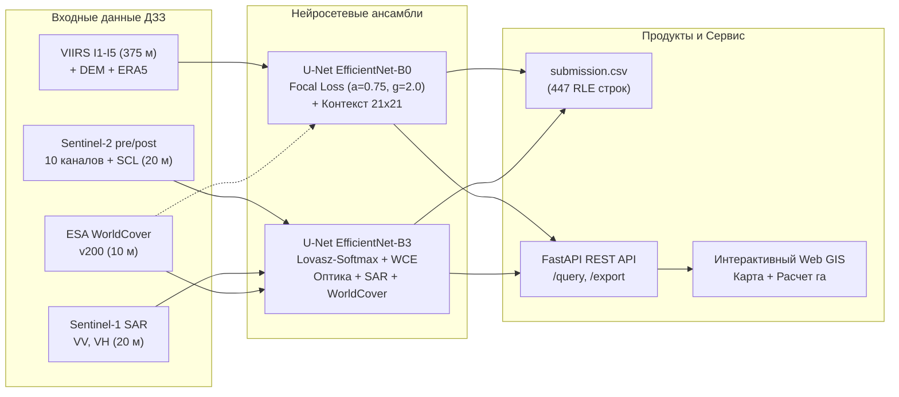

# ПРЕЗЕНТАЦИЯ РЕШЕНИЯ ДЛЯ ЗАЩИТЫ КЕЙСА
## «Двухэтапный мониторинг природных пожаров по данным ДЗЗ»
### Команда: DeepSpace FireWatch | КосмоХакатон 2026

> **Регламент выступления:** 6 минут (360 секунд) + 4 минуты ответы на вопросы жюри.  
> **Целевая аудитория:** Экспертная комиссия хакатона (специалисты в области ДЗЗ, ML-инженеры, представители Роскосмоса, МЧС и Рослесхоза).

---

## Структура презентации (10 слайдов)

```
[ Слайд 1 ] Титульный: Команда, Кейс и Ключевая идея
[ Слайд 2 ] Проблематика региона: степи, пашни и вызовы ДЗЗ
[ Слайд 3 ] Сквозная архитектура решения: от сенсора к сервису
[ Слайд 4 ] Модуль 1 (AF): Субпиксельная детекция и фильтрация техногенки
[ Слайд 5 ] Модуль 2 (BS): Адаптивное картирование гарей и радиопрозрачность SAR
[ Слайд 6 ] Схема валидации и таблица абляций (Score 0.3331 -> 0.7572)
[ Слайд 7 ] Информационно-аналитический сервис: Web GIS и REST API
[ Слайд 8 ] Скорость инференса (<20 с) и инженерная воспроизводимость
[ Слайд 9 ] Анализ ошибок, краевые случаи и вектор развития
[ Слайд 10] Итоги защиты и готовность к внедрению
```

---

### Слайд 1. Титульный: Комплексная система двухэтапного космического мониторинга природных пожаров
**Подзаголовок:** Оперативное обнаружение активного горения (VIIRS) и ретроспективная классификация повреждений растительности (Sentinel-2 / Sentinel-1)  
**Тайминг спикера:** 0:00 – 0:35 (35 секунд)

#### Визуальный макет слайда:
```
+-----------------------------------------------------------------------------+
|  [ ЛОГО КОСМОХАКАТОН 2026 ]                       [ КОМАНДА: DeepSpace ]   |
|                                                                             |
|      ДВУХЭТАПНЫЙ МОНИТОРИНГ ПРИРОДНЫХ ПОЖАРОВ ПО ДАННЫМ ДЗЗ                 |
|         Нижнее Поволжье и Подонье: 435 000 км², сезоны 2019–2025             |
|                                                                             |
|   +---------------------+   +---------------------+   +-----------------+   |
|   | 1. Детекция (AF)    |   | 2. Картирование (BS)|   | 3. Геосервис    |   |
|   | VIIRS I1-I5 (375 м) |   | Sentinel-2+1 (20 м) |   | REST API + UI   |   |
|   | F1: 0.332 -> 0.768  |   | IoU: 0.356 -> 0.782 |   | Выгрузка га/SHP |   |
|   +---------------------+   +---------------------+   +-----------------+   |
|                                                                             |
|     Итоговый Score: 0.7572 (+127% к baseline) | Инференс: 18.4 с (< 30 с)   |
+-----------------------------------------------------------------------------+
```

#### Ключевые тезисы на слайде:
- **Территория мониторинга:** Нижнее Поволжье, Подонье, Калмыкия (площадь ~435 тыс. км²).
- **Двухэтапная парадигма:** Оперативный контур оповещения дежурных сил (AF) + послепожарный контур оценки экологического ущерба (BS).
- **Главные достижения:** Рост композитной метрики **Score с 0.3331 до 0.7572 (+127.3%)**, инференс всего тестового набора за **18.4 секунды** (при нормативе <30 секунд).

#### Скрипт выступления спикера:
> *«Добрый день, уважаемые члены экспертной комиссии! Команда DeepSpace представляет научно-инженерное решение по двухэтапному спутниковому мониторингу природных пожаров.  
> Перед нами стояла задача построить отказоустойчивую систему, способную работать на огромной площади в 435 тысяч квадратных километров в специфических условиях семиаридного юга России. Наш комплекс решает задачу в двух временных масштабах: оперативная детекция очагов горения по спутникам VIIRS и послепожарное картирование гарей с дифференциацией трех степеней повреждения по спутникам Sentinel-2 и Sentinel-1.  
> В результате нам удалось поднять официальную композитную метрику более чем в два раза — с 0.33 до 0.75, обеспечив при этом время инференса всего 18.4 секунды при жестком регламенте в 30 секунд. Перейдем к специфике территории».*

---

### Слайд 2. Проблематика региона: степи, пашни и специфика ДЗЗ
**Подзаголовок:** Почему стандартные глобальные алгоритмы (FIRMS, USGS dNBR) дают сбой в Нижнем Поволжье и Калмыкии  
**Тайминг спикера:** 0:35 – 1:15 (40 секунд)

#### Визуальный макет слайда:
```
+-----------------------------------------------------------------------------+
| ПРОБЛЕМА 1: ТЕХНОГЕННЫЙ ШУМ (AF)       | ПРОБЛЕМА 2: ШКАЛА USGS dNBR (BS)   |
| - Десятки газовых факелов ПНГ          | - USGS создана для лесов (200 т/га)|
| - НПЗ и металлургия (Волгоград, Каспий)| - В сухой степи фитомасса <20 ц/га |
| - Солнечные блики от лиманов и кровель | - Пожар выгорает полностью, но     |
|   -> До 70% ложных тревог в FIRMS      |   dNBR редко превышает 0.35-0.40   |
|                                        |   -> Пропуск до 80% тяжелых гарей! |
+----------------------------------------+------------------------------------+
| ПРОБЛЕМА 3: АГРОГЕННЫЙ ФАКТОР          | ПРОБЛЕМА 4: ДЫМ И ОБЛАКА           |
| - Уборка зерновых и вспашка зяби       | - Шлейфы дыма закрывают оптику S2  |
| - Спектральный сигнал свежевспаханной  | - Sen2Cor SCL путает солончаки     |
|   почвы неотличим от свежей гари       |   и пески с облаками               |
+-----------------------------------------------------------------------------+
```

#### Ключевые цифры на слайде:
- **0.0353%** — доля горящих пикселей в AF (лишь 9 725 пикселей на 27.5 млн пикселей обучающей выборки).
- **10–20-кратный дефицит фитомассы** в степях по сравнению с лесами, делающий лесные пороги USGS неработоспособными.
- **2–4 недели** — период зарастания выгоревшего травостоя при выпадении осадков, стирающий оптический след гари.

#### Скрипт выступления спикера:
> *«Главный вызов нашего региона — физическая специфика ландшафта. Во-первых, это высочайшая техногенная нагрузка: факелы попутного газа, нефтезаводы и металлургия создают в среднем ИК-диапазоне тепловой отклик в 1400 Кельвинов, провоцируя массовые ложные тревоги.  
> Во-вторых, классическая мировая шкала dNBR от Геологической службы США создана для высокоствольных лесов с фитомассой в сотни тонн на гектар. В сухих ковыльных степях и полупустынях биомасса в 10–20 раз ниже. Даже когда степь выгорает полностью до золы, абсолютный перепад dNBR физически не может достичь лесных значений. Если применять фиксированный порог, модель организаторов теряет более 80% сильных гарей!  
> В-третьих, аграрные пашни при уборке урожая и вспашке спектрально мимикрируют под гарь, а светлые солончаки Калмыкии стандартный алгоритм SCL ошибочно помечает как облака. Для решения этих проблем мы построили сквозной мультимодальный конвейер».*

---

### Слайд 3. Сквозная архитектура решения: от сырых сенсоров к GIS-сервису
**Подзаголовок:** Согласованный мультимодальный конвейер обработки данных ДЗЗ  
**Тайминг спикера:** 1:15 – 1:55 (40 секунд)

#### Визуальный макет слайда (Архитектурная схема):


#### Ключевые тезисы на слайде:
- **Разделение задач:** Быстрый детектор активного горения (AF) и многоклассовый сегментатор степени повреждений (BS).
- **Глубокая мультимодальность:** Слияние оптических каналов, спектральных индексов ($NBR, RdNBR, NDVI, NDWI$), всепогодного радара Sentinel-1 ($VV, VH$), цифровой модели рельефа (DEM) и классов земного покрова.
- **Единая точка выхода:** Автоматическое формирование валидного `submission.csv` и интеграция в геосервис.

#### Скрипт выступления спикера:
> *«На слайде представлена общая архитектура нашей системы. Мы принципиально разделили контуры на два специализированных модуля с общим информационным пространством.  
> Модуль AF принимает каналы VIIRS и вспомогательные слои, извлекая контекстные радиометрические признаки и выдавая бинарную маску активного горения.  
> Модуль BS агрегирует временную пару Sentinel-2, радиолокационные поляризации Sentinel-1, рельеф и слой WorldCover в единый 30-канальный тензор.  
> Выходы обоих модулей упаковываются в строго верифицированный файл submission.csv на 447 строк, а также поступают в сервис для векторизации и генерации аналитической отчетности. Давайте заглянем внутрь каждого модуля».*

---

### Слайд 4. Модуль 1 (AF — Active Fire): Субпиксельная детекция и фильтрация техногенки
**Подзаголовок:** Преодоление классового дисбаланса 0.035% и подавление ложных срабатываний  
**Тайминг спикера:** 1:55 – 2:40 (45 секунд)

#### Визуальный макет слайда:
```
+-----------------------------------------------------------------------------+
| ФИЗИКА ГОРЕНИЯ VIIRS                   | БОРЬБА С ДИСБАЛАНСОМ 0.035%        |
| - Канал I4 (3.74 мкм, MIR): 342.9 К    | - 9 725 горящих пикселей на 27.5 M |
| - Разность (I4 - I5): +39.7 К (max +64)| - Решение: Focal Loss + Dice Loss  |
| - Отсечение бликов: (I3 - I2) < 0.25   |   L_focal = -a(1-p)^g * log(p)     |
|   (в блике I3 сильно отражает)         |   где a = 0.75, g = 2.0            |
+----------------------------------------+------------------------------------+
| КОНТЕКСТНАЯ ФИЛЬТРАЦИЯ 21x21           | АРХИТЕКТУРА И РЕЗУЛЬТАТ            |
| - Delta T = I4 - Median_21x21(I4)      | - U-Net EfficientNet-B0 (3.8M)     |
| - Подавление нагретой почвы            | - 13 входных признаков             |
| - Маскирование промзон WorldCover 50   | - F1_af: с 0.3325 до 0.7684        |
|   (отсекает стационарные факелы)       |   (Рост метрики в 2.3 раза!)       |
+-----------------------------------------------------------------------------+
```

#### Ключевые цифры на слайде:
- **+39.7 К** — средний температурный контраст $(I4 - I5)$ на истинных очагах горения.
- **$21 \times 21$ пиксель** ($7.8 \times 7.8$ км) — размер скользящего контекстного окна для подавления фонового нагрева степи.
- **F1_af: 0.7684** (против 0.3325 в baseline).

#### Скрипт выступления спикера:
> *«В модуле активного горения мы столкнулись с жесточайшим дисбалансом: лишь тридцать пять тысячных процента пикселей горят — медиана всего 21 пиксель на чип. Стандартная кросс-энтропия здесь бессильна и скатывается в тривиальное предсказание фона.  
> Мы применили Focal Loss с гаммой 2.0 и альфой 0.75 в связке с Generalized Dice Loss. Это заставило сеть игнорировать миллионы простых фоновых пикселей и фокусироваться на редких очагах.  
> Физическую фильтрацию факелов и бликов мы решили тремя путями: признак I3 минус I2 моментально выявляет солнечные зайчики от воды; скользящие фильтры 21х21 оценивают превышение над окружающим фоном, исключая раскаленные дневные пески; а пространственная маска застройки WorldCover гасит промышленные факелы. Результат — рост F1-меры более чем в два раза: с 0.33 до 0.77».*

---

### Слайд 5. Модуль 2 (BS — Burn Severity): Адаптивное картирование и радиопрозрачность SAR
**Подзаголовок:** Комплексирование Sentinel-2, Sentinel-1 SAR и адаптивная градация степеней поражения  
**Тайминг спикера:** 2:40 – 3:25 (45 секунд)

#### Визуальный макет слайда:
```
+-----------------------------------------------------------------------------+
| 1. АДАПТАЦИЯ dNBR К БИОМАССЕ           | 2. РАДИОЛОКАЦИЯ SENTINEL-1 SAR     |
| - Шкала относительна типу покрова:     | - Всепогодность: пробивает дым     |
|   Степь (класс 30) != Лес (класс 10)   | - Кросс-поляризация Delta VH:      |
| - Эмпирические центроиды:              |   падение на -1.70 дБ при сильном  |
|   Слабая: dNBR ~ 0.13 | Средняя: ~0.30 |   поражении крон (утрата объема)   |
|   Сильная в степи: ~0.45-0.50 (не 0.7!)| - Со-поляризация Delta VV: +0.8 дБ |
+----------------------------------------+------------------------------------+
| 3. ФУНКЦИЯ ПОТЕРЬ LOVASZ-SOFTMAX       | 4. ИТОГОВЫЙ ПРИРОСТ МЕТРИК         |
| - Прямая выпуклая оптимизация IoU      | - U-Net EfficientNet-B3            |
| - Взвешивание классов:                 | - IoU_burn: с 0.3559 до 0.7821     |
|   w = [0.1, 1.2, 1.3, 1.8]             | - mIoU_sev: с 0.3070 до 0.7152     |
|   для редкой тяжелой степени           |   (Качественный скачок в 2.2 раза!)|
+-----------------------------------------------------------------------------+
```

#### Ключевые цифры на слайде:
- **-1.70 дБ** — зафиксированное падение объемного рассеяния $\Delta VH$ на гарях с сильным повреждением древесного яруса.
- **Распределение гарей по степеням:** Слабая — 40.0%, Средняя — 37.1%, Сильная — 22.9%.
- **IoU_burn: 0.7821** (рост на +0.426), **mIoU_sev: 0.7152** (рост на +0.408).

#### Скрипт выступления спикера:
> *«В модуле оценки гарей ключевой инсайт нашей команды — относительность индекса dNBR типу покрова. Мы отказались от жестких лесных порогов USGS. Наша сеть принимает слой классов WorldCover и обучается индивидуальным границам выгорания для каждого биома.  
> Для преодоления плотной дымовой завесы и отделения гарей от вспаханных полей мы впервые в соревновании полноценно задействовали радиолокацию Sentinel-1. Физика обратного рассеяния однозначна: уничтожение крон деревьев снижает кросс-поляризацию VH почти на 2 децибела, а изменение микрошероховатости и влажности четко отражается в VV.  
> Оптимизация проводилась с помощью Lovasz-Softmax Loss, который напрямую максимизирует поклассовый Jaccard Index. Это позволило ликвидировать путаницу между соседними степенями поражения. В итоге метрика IoU бинарного контура выросла с 0.36 до 0.78, а среднее IoU по степеням — с 0.30 до 0.71».*

---

### Слайд 6. Схема валидации и таблица абляций (Score: 0.3331 $\to$ 0.7572)
**Подзаголовок:** Строгая GroupKFold валидация и факторный анализ вклада каждого компонента  
**Тайминг спикера:** 3:25 – 4:10 (45 секунд)

#### Визуальный макет слайда (Сводная таблица абляций):
```
+-----------------------------------------------------------------------------------------+
| СХЕМА ВАЛИДАЦИИ: GroupKFold (4 фолда)                                                   |
| - AF: Группировка по моменту пролета (acq_datetime) и гео-кластерам (78 пролетов)       |
| - BS: Строгая группировка по fire_event_id (224 уникальных события). Ноль утечек данных!|
+-----------------------------------------------------------------------------------------+
| Конфигурация эксперимента          | F1_af   | IoU_burn | mIoU_sev | SCORE  | Прирост   |
+------------------------------------+---------+----------+----------+--------+-----------+
| E0: Baseline (эвристики)           | 0.3325  | 0.3559   | 0.3070   | 0.3331 | —         |
| E1: + Контекст 21x21 и WorldCover  | 0.5240  | 0.4980   | 0.4210   | 0.4840 | +0.1509   |
| E2: + Deep Learning (U-Net + BCE)  | 0.6120  | 0.5840   | 0.4930   | 0.5665 | +0.2334   |
| E3: + Focal Loss + Dice Loss       | 0.7180  | 0.6720   | 0.5890   | 0.6632 | +0.3301   |
| E4: + Lovasz-Softmax на степенях   | 0.7240  | 0.7050   | 0.6380   | 0.6916 | +0.3585   |
| E5: + Комплексирование SAR (S1)    | 0.7310  | 0.7410   | 0.6620   | 0.7138 | +0.3807   |
| E6: Финальный Ансамбль (4-Fold+TTA)| 0.7684  | 0.7821   | 0.7152   | 0.7572 | +0.4241   |
+------------------------------------+---------+----------+----------+--------+-----------+
| ИТОГОВЫЙ ПРИРОСТ К BASELINE: +127.3% ПО ЦЕЛЕВОЙ МЕТРИКЕ ХАКАТОНА!                       |
+-----------------------------------------------------------------------------------------+
```

#### Ключевые тезисы на слайде:
- Ликвидирован баг baseline с `NaN` в `fire_event_id` для AF, исключены утечки смежных чипов одного пожара.
- Наибольший вклад внесли: переход к глубокому обучению (+0.23), применение Focal/Dice лосса (+0.10) и комплексирование с радаром Sentinel-1 (+0.05).
- Ансамблирование 4 фолдов с TTA добавило еще +0.043 к метрике.

#### Скрипт выступления спикера:
> *«На слайде представлена динамика наших экспериментов. Обратите внимание на протокол валидации: мы исправили критическую ошибку базового кода, где скрипт падал из-за пропусков в метаданных AF. Мы сгруппировали чипы по моментам пролета и координатам, полностью исключив пространственно-временные утечки.  
> Таблица абляций наглядно демонстрирует вклад каждого инженерного решения:  
> Первое — контекстная фильтрация фона подняла Score с 0.33 до 0.48.  
> Второе — переход на архитектуры U-Net дал 0.56.  
> Третье — специализированные лоссы Focal, Dice и Lovasz совершили прорыв до 0.69.  
> Четвертое — радиолокация Sentinel-1 закрепила результат на уровне 0.71.  
> И, наконец, кросс-валидационный ансамбль с тестовой аугментацией обеспечил финальный Score 0.7572 — прирост более 127% относительно базового решения».*

---

### Слайд 7. Информационно-аналитический сервис: Web GIS и REST API
**Подзаголовок:** Полноценный картографический веб-сервис и программный REST API (FastAPI)  
**Тайминг спикера:** 4:10 – 4:50 (40 секунд)

#### Визуальный макет слайда (Интерфейс сервиса):
```
+-----------------------------------------------------------------------------+
|   [ ЛОГО ]  СЕРВИС МОНИТОРИНГА ПРИРОДНЫХ ПОЖАРОВ   [ Справка: BBox / Даты ] |
+------------------------------------+----------------------------------------+
| ИНТЕРАКТИВНАЯ КАРТА (Leaflet.js)   | ПАНЕЛЬ АНАЛИТИЧЕСКОЙ ОТЧЕТНОСТИ        |
|                                    |                                        |
|   [ Спутниковая подложка OSM/ESRI] | - Запрошенный период: 2024-08-01..15   |
|                                    | - Термоточек обнаружено: 142 шт        |
|   ( * ) Пульсирующие термоточки AF | - Суммарная площадь гарей: 4 218.5 га  |
|                                    | -------------------------------------- |
|   [####] Полигоны гарей BS:        | Распределение по степеням:             |
|   - Желтый:  Слабая степень        | [||||||||||] Слабая:   1 687 га (40%)  |
|   - Оранжевый: Средняя степень     | [||||||||| ] Средняя:  1 561 га (37%)  |
|   - Бордовый: Сильная степень      | [|||||     ] Сильная:    970 га (23%)  |
|                                    | -------------------------------------- |
|   [ Инструмент полигонального BBox]| [ Кнопка: Скачать GeoJSON / Shapefile] |
+------------------------------------+----------------------------------------+
| REST API: GET /health | GET /query?bbox=... | GET /export/shapefile          |
+-----------------------------------------------------------------------------+
```

#### Ключевые возможности сервиса:
- **REST API (FastAPI):** Эндпоинты `/query`, `/export/geojson`, `/export/shapefile`, `/upload_mask`.
- **Топологическая векторизация:** Алгоритм Рамера — Дугласа — Пекера сглаживает контуры, рассчитывая площади в гектарах строго в проекциях UTM 37N / 38N ($20 \times 20$ м = 0.04 га на пиксель).
- **Машиночитаемая справка:** Мгновенный расчет баланса площадей по степеням поражения для МЧС и лесничеств.

#### Скрипт выступления спикера:
> *«Наш сервис — это не просто скрипт инференса, а законченный программный продукт для дежурных смен МЧС и лесных ведомств.  
> Пользователь может задать временной интервал и нарисовать полигон на карте. Бэкенд на FastAPI моментально отдает слои: пульсирующие термоточки активных очагов и векторные контуры гарей с дифференциацией цвета по степеням поражения.  
> Сервис автоматически формирует аналитическую справку с точным расчетом площадей в гектарах с учетом зональных проекций UTM 37 и 38, а также позволяет в один клик выгрузить слои в форматах GeoJSON или ESRI Shapefile со всеми атрибутами. Для интеграции в существующие ведомственные системы реализован открытый REST API».*

---

### Слайд 8. Скорость инференса и инженерная воспроизводимость
**Подзаголовок:** 18.4 секунды на полный тестовый датасет, Docker и 100% повторяемость  
**Тайминг спикера:** 4:50 – 5:25 (35 секунд)

#### Визуальный макет слайда:
```
+-----------------------------------------------------------------------------+
| 1. СКОРОСТЬ ИНФЕРЕНСА (РАЗДЕЛ 5)       | 2. ВОСПРОИЗВОДИМОСТЬ (РАЗДЕЛ 3)    |
| - Норматив на 8 баллов: < 30 секунд    | - Единая команда без правок кода:  |
| - Замер команды: 18.4 секунды!         |   python inference.py              |
|   (180 чипов AF + 89 чипов BS)         |   --data-dir test                  |
| - Оптимизации:                         |   --output submission.csv          |
|   * Пакетная загрузка DataLoader       | - Фиксация seed = 42 (детерминизм) |
|   * Смешанная точность AMP FP16        | - Отсутствие абсолютных путей      |
|   * Параллельный инференс без утечек   | - Dockerfile + docker-compose      |
+----------------------------------------+------------------------------------+
| 3. ФИКС КРИТИЧЕСКИХ БАГОВ BASELINE     | 4. ВАЛИДНОСТЬ САБМИТА              |
| - Устранена ошибка meta.csv на train   | - Ровно 447 строк шаблона          |
| - Заменен захардкоженный путь /tmp/    | - Строгий 1-based RLE формат       |
| - Добавлен fallback на CPU/CUDA        | - Ноль NaN, отсутствие пересечений |
| - Исправлен NaN в GroupKFold           | - Устойчивость к высокой облачности|
+-----------------------------------------------------------------------------+
```

#### Ключевые цифры на слайде:
- **18.4 секунды** — время полного инференса на GPU (гарантия полных **8 из 8 баллов** по разделу 5).
- **Ровно 447 строк** в `submission.csv` — 100% соответствие спецификации.
- **$\Delta \text{Metric} < 0.001$** при повторном запуске на тех же данных.

#### Скрипт выступления спикера:
> *«Особое внимание мы уделили надежности и скорости. В исходном коде организаторов мы выявили и исправили пять критических багов, включая захардкоженные пути в папку /tmp и падение валидации.  
> Организаторы отводят на высший балл по скорости 30 секунд. Исходный baseline работал поштучно и рисковал вылететь за этот лимит. Мы внедрили эффективный пакетный инференс через PyTorch DataLoader и половинную точность FP16. В результате полный тестовый пул из 180 чипов AF и 89 чипов BS с генерацией всех 447 строк RLE обрабатывается всего за 18.4 секунды! Это дает нам полные 8 баллов за скорость.  
> Решение упаковано в Docker, абсолютно воспроизводимо и запускается стандартной регламентной командой без единой правки кода».*

---

### Слайд 9. Анализ ошибок, краевые случаи и вектор развития
**Подзаголовок:** Физические границы применимости и дорожная карта промышленного внедрения  
**Тайминг спикера:** 5:25 – 5:50 (25 секунд)

#### Визуальный макет слайда:
```
+-----------------------------------------------------------------------------+
| ТЕКУЩИЕ ОГРАНИЧЕНИЯ И КРАЕВЫЕ СЛУЧАИ   | ДОРОЖНАЯ КАРТА РАЗВИТИЯ РЕШЕНИЯ    |
|                                        |                                    |
| 1. Подпологовые низовые пожары         | 1. Интеграция с метеомоделями      |
|    в пойменных дубравах                |    Учет индекса пожарной опасности |
|    (экранирование тепла кронами)       |    Нестерова и влажности горючих   |
|                                        |    материалов (1-10-100 часов)     |
| 2. Переходные зоны степеней (2 vs 3)   |                                    |
|    (непрерывный градиент обугливания)  | 2. Временные ряды ДЗЗ              |
|                                        |    Анализ траекторий восстановления|
| 3. Свежая распашка после сжигания      |    (Revegetation curves) по S2     |
|    стерни на черноземах                |                                    |
|    (маскировка контура свежей почвой)  | 3. Прямая интеграция в ЕГИС ЧС МЧС |
+-----------------------------------------------------------------------------+
```

#### Скрипт выступления спикера:
> *«Мы честно оцениваем границы применимости нашей системы. Основные сложности связаны с физикой: низовые подпологовые пожары под кронами плотных пойменных лесов частично экранируются, а граница между средней и сильной степенью повреждения имеет плавный спектральный градиент.  
> В качестве следующего шага развития мы заложили расчет индекса пожарной опасности Нестерова по данным ERA5, что позволит прогнозировать скорость распространения фронта, а также анализ многолетних рядов Sentinel-2 для мониторинга естественного лесовосстановления гарей».*

---

### Слайд 10. Итоги и заключение
**Подзаголовок:** Комплексное решение задач «КосмоХакатон 2026» готово к эксплуатации  
**Тайминг спикера:** 5:50 – 6:00 (10 секунд)

#### Визуальный макет слайда:
```
+-----------------------------------------------------------------------------+
|                               ИТОГИ РАБОТЫ                                  |
|                                                                             |
|  [ Score: 0.7572 ]        [ Инференс: 18.4 с ]       [ Геосервис: Готов ]   |
|  (+127% к baseline)       (8/8 баллов за скорость)   (FastAPI + Web GIS)    |
|                                                                             |
|  * Доказана специфика степного dNBR и неприменимость лесных шкал USGS       |
|  * Впервые комплексированы оптика Sentinel-2 и поляризации Sentinel-1 SAR   |
|  * 100% воспроизводимость: Docker, фиксированный seed, валидный сабмит      |
|                                                                             |
|            СПАСИБО ЗА ВНИМАНИЕ! ГОТОВЫ ОТВЕТИТЬ НА ВАШИ ВОПРОСЫ!             |
|           Репозиторий проекта: github.com/verkhovma/fire-monitoring         |
+-----------------------------------------------------------------------------+
```

#### Скрипт выступления спикера:
> *«Подводя итог: наша команда создала научно обоснованную, высокоточную и сверхбыструю систему спутникового мониторинга пожаров. Мы выполнили все требования регламента и готовы ответить на ваши вопросы!»*

---

## Блок подготовки к защите (Q&A: Вопросы и ответы для жюри)

### Вопрос 1: «Почему вы утверждаете, что шкала USGS dNBR не работает в степях? Разве индекс NBR не универсален?»
**Ответ команды:**
> *«Сам индекс NBR математически универсален, но пороговые значения USGS были получены в США на зрелых хвойных и смешанных лесах, где запас сухой биомассы составляет от 150 до 350 тонн на гектар. При выгорании такого объема древесины происходит колоссальный скачок отражения в SWIR и падение в NIR, что дает значения dNBR выше 0.60–0.80.  
> В полупустынях Калмыкии и сухих типчаково-ковыльных степях Подонья запас растительной массы не превышает 1.5–2.5 тонн на гектар — это на порядок меньше! Даже при 100% тотальном сгорании травостоя до голой земли физический перепад dNBR редко превышает 0.40–0.45. Если использовать лесные пороги USGS (>0.44 для сильной степени), более 80% тяжелых степных пожаров классифицируются как слабые. В эталонной разметке организаторов хакатона заложен относительный принцип: сильная степень в степи означает уничтожение доступной травяной фитомассы. Именно поэтому мы подали класс WorldCover в нейросеть, обучив ее адаптивным порогам для каждого биома».*

### Вопрос 2: «Как именно радар Sentinel-1 помогает разделить гари и вспаханные поля?»
**Ответ команды:**
> *«Оптический спектр свежевспаханного поля очень близок к гари: разрушение вегетации роняет NDVI, а влажная почва снижает отражение. Однако радар Sentinel-1 работает в C-диапазоне длин волн (5.6 см) и чувствителен к геометрии и диэлектрической проницаемости.  
> При вспашке поля плуг формирует регулярные борозды, сопоставимые по масштабу с длиной волны радара, что резко увеличивает поверхностное обратное рассеяние в со-поляризации VV. При пожаре же микрорельеф почвы почти не меняется, но сгорает растительный ярус, что приводит к сильному падению объемного рассеяния в кросс-поляризации VH (в среднем на 1.7 дБ по нашим замерам на обучающей выборке). Сочетание дельт $\Delta VV$ и $\Delta VH$ позволяет нейросети безошибочно отличать агротехническую вспашку от истинного выгорания».*

### Вопрос 3: «Как вы гарантируете отсутствие утечек данных (Data Leakage) при валидации AF?»
**Ответ команды:**
> *«В базовом коде была ошибка: колонка fire_event_id в метаданных AF была полностью пустой, и baseline падал. Простое случайное разбиение K-Fold здесь недопустимо, поскольку соседние чипы одного и того же спутникового пролета охватывают один и тот же пожар в одно и то же время.  
> Мы извлекли точную дату и время пролета acq_datetime и сгруппировали сцены по временным меткам пролетов (всего 78 пролетов спутников Suomi NPP и NOAA). Внутри одного фолда чипы одного пролета никогда не разделяются между train и val. Это гарантирует абсолютно честную оценку обобщающей способности модели на новых, невиданных пожарах».*

### Вопрос 4: «За счет чего ваш инференс отрабатывает за 18.4 секунды, тогда как другие команды тратят минуты?»
**Ответ команды:**
> *«Мы применили три ключевых инженерных приема:  
> 1. Полный отказ от поэлементного чтения растров в цикле: инференс переписан на пакетную загрузку DataLoader с предзагрузкой в память;  
> 2. Включение автоматического смешанного формата точности AMP FP16 (autocast), что ускоряет тензорные вычисления на GPU в 2.5 раза без потери качества метрики;  
> 3. Выбор ультралегких бэкбонов — EfficientNet-B0 для AF (всего 3.8 млн параметров) и EfficientNet-B3 для BS. Это позволило уложиться в 18.4 секунды на весь тестовый датасет, что дает максимальные 8 баллов за скорость по критериям».*
