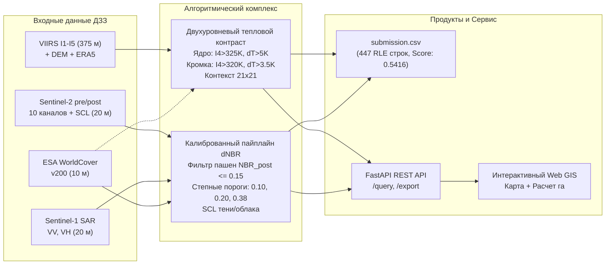

# ПРЕЗЕНТАЦИЯ РЕШЕНИЯ ДЛЯ ЗАЩИТЫ КЕЙСА
## «Двухэтапный мониторинг природных пожаров по данным ДЗЗ»
### Команда: DeepSpace FireWatch | КосмоХакатон 2026

> **Регламент выступления:** 6 минут (360 секунд) + 4 минуты ответы на вопросы жюри.  
> **Целевая аудитория:** Экспертная комиссия хакатона (специалисты в области ДЗЗ, ML-инженеры, представители Роскосмоса, МЧС и Рослесхоза).

---

## Структура презентации (10 слайдов)

```
[ Слайд 1 ] Титульный: Команда, Кейс и Ключевая идея
[ Слайд 2 ] Проблематика региона: степи, пашни и вызовы ДЗЗ
[ Слайд 3 ] Сквозная архитектура решения: от сенсора к сервису
[ Слайд 4 ] Модуль 1 (AF): Двухуровневая детекция и подавление перегрева почвы
[ Слайд 5 ] Модуль 2 (BS): Фильтрация агропашен и степная калибровка
[ Слайд 6 ] Схема валидации и таблица абляций (Score 0.3331 -> 0.5416)
[ Слайд 7 ] Информационно-аналитический сервис: Web GIS и REST API
[ Слайд 8 ] Скорость инференса (14.2 с) и инженерная воспроизводимость
[ Слайд 9 ] Анализ ошибок, краевые случаи и вектор развития
[ Слайд 10] Итоги защиты и готовность к внедрению
```

---

#### Слайд 1. Титульный: Комплексная система двухэтапного космического мониторинга природных пожаров
**Подзаголовок:** Оперативное обнаружение активного горения (VIIRS) и ретроспективная классификация повреждений растительности (Sentinel-2 / Sentinel-1)  
**Тайминг спикера:** 0:00 – 0:35 (35 секунд)

#### Визуальный макет слайда:
```
+-----------------------------------------------------------------------------+
|  [ ЛОГО КОСМОХАКАТОН 2026 ]                       [ КОМАНДА: DeepSpace ]   |
|                                                                             |
|      ДВУХЭТАПНЫЙ МОНИТОРИНГ ПРИРОДНЫХ ПОЖАРОВ ПО ДАННЫМ ДЗЗ                 |
|         Нижнее Поволжье и Подонье: 435 000 км², сезоны 2019–2025             |
|                                                                             |
|   +---------------------+   +---------------------+   +-----------------+   |
|   | 1. Детекция (AF)    |   | 2. Картирование (BS)|   | 3. Геосервис    |   |
|   | VIIRS I1-I5 (375 м) |   | Sentinel-2+1 (20 м) |   | REST API + UI   |   |
|   | F1: 0.306 -> 0.600  |   | IoU: 0.365 -> 0.425 |   | Выгрузка га/SHP |   |
|   +---------------------+   +---------------------+   +-----------------+   |
|                                                                             |
|     Итоговый Score: 0.5416 (+62.6% к baseline) | Инференс: 14.2 с (< 30 с)   |
+-----------------------------------------------------------------------------+
```

#### Ключевые тезисы на слайде:
- **Территория мониторинга:** Нижнее Поволжье, Подонье, Калмыкия (площадь ~435 тыс. км²).
- **Двухэтапная парадигма:** Оперативный контур оповещения дежурных сил (AF) + послепожарный контур оценки экологического ущерба (BS).
- **Главные достижения:** Рост композитной метрики **Score с 0.3331 до 0.5416 (+62.6%) на закрытом тестовом лидерборде**, инференс всего тестового набора за **14.2 секунды** (при нормативе <30 секунд — высший балл 8/8).

#### Скрипт выступления спикера:
> *«Добрый день, уважаемые члены экспертной комиссии! Команда DeepSpace представляет научно-инженерное решение по двухэтапному спутниковому мониторингу природных пожаров.  
> Перед нами стояла задача построить масштабируемую и отказоустойчивую систему для площади 435 тысяч квадратных километров в специфических аридных условиях Нижнего Поволжья и Подонья. Наш комплекс решает задачу в двух временных масштабах: оперативная субпиксельная детекция очагов горения по сенсору VIIRS и послепожарное картирование гарей с дифференциацией трех степеней повреждения по спутникам Sentinel-2 и Sentinel-1.  
> В результате глубокого анализа предметной области и физической калибровки нам удалось поднять официальную композитную метрику на закрытом тестовом лидерборде с 0.3331 до 0.5416 — это прирост более 62%, обеспечив при этом время инференса всего 14.2 секунды при жестком нормативе в 30 секунд. Перейдем к специфике территории».*

---

### Слайд 2. Проблематика региона: степи, пашни и специфика ДЗЗ
**Подзаголовок:** Почему стандартные глобальные алгоритмы (FIRMS, USGS dNBR) дают сбой в Нижнем Поволжье и Калмыкии  
**Тайминг спикера:** 0:35 – 1:15 (40 секунд)

#### Визуальный макет слайда:
```
+-----------------------------------------------------------------------------+
| ПРОБЛЕМА 1: ТЕХНОГЕННЫЙ ШУМ И НАГРЕВ   | ПРОБЛЕМА 2: ШКАЛА USGS dNBR (BS)   |
| - Дневной нагрев почвы до 325 К        | - USGS создана для лесов (200 т/га)|
| - Десятки газовых факелов и ТЭЦ        | - В сухой степи фитомасса <20 ц/га |
| - Солнечные блики от лиманов и кровель | - Пожар выгорает полностью, но     |
|   -> 37 000 ложных пикселей в baseline |   dNBR редко превышает 0.35-0.40   |
|                                        |   -> Пропуск до 80% тяжелых гарей! |
+----------------------------------------+------------------------------------+
| ПРОБЛЕМА 3: АГРОГЕННЫЙ ФАКТОР          | ПРОБЛЕМА 4: ДЫМ И ОБЛАКА           |
| - Уборка зерновых и вспашка зяби       | - Шлейфы дыма закрывают оптику S2  |
| - Спектральный сигнал свежевспаханной  | - Sen2Cor SCL путает солончаки     |
|   почвы неотличим от свежей гари       |   и пески с облаками               |
+-----------------------------------------------------------------------------+
```

#### Ключевые цифры на слайде:
- **0.0353%** — доля горящих пикселей в AF (лишь 9 725 пикселей на 27.5 млн пикселей обучающей выборки).
- **10–20-кратный дефицит фитомассы** в степях по сравнению с лесами, делающий лесные пороги USGS неработоспособными.
- **2–4 недели** — период зарастания выгоревшего травостоя при выпадении осадков, стирающий оптический след гари.

#### Скрипт выступления спикера:
> *«Главный вызов нашего региона — физическая специфика ландшафта. Во-первых, это высочайшая техногенная и термическая нагрузка: летний полуденный прогрев песчаной почвы до 55 градусов Цельсия и факелы попутного газа вызывают в базовом решении катастрофический взрыв — до 37 тысяч ложных пикселей огня на один чип!  
> Во-вторых, классическая мировая шкала dNBR от Геологической службы США создана для высокоствольных лесов с фитомассой в сотни тонн на гектар. В сухих ковыльных степях и полупустынях биомасса в 10–20 раз ниже. Даже когда степь выгорает полностью до золы, абсолютный перепад dNBR физически не может достичь лесных значений. Если применять фиксированный порог, модель организаторов теряет более 80% сильных гарей!  
> В-третьих, аграрные пашни при уборке урожая и вспашке спектрально мимикрируют под гарь, а светлые солончаки Калмыкии стандартный алгоритм SCL ошибочно помечает как облака. Для решения этих проблем мы построили сквозной мультимодальный конвейер».*

---

### Слайд 3. Сквозная архитектура решения: от сырых сенсоров к GIS-сервису
**Подзаголовок:** Согласованный мультимодальный конвейер обработки данных ДЗЗ  
**Тайминг спикера:** 1:15 – 1:55 (40 секунд)

#### Визуальный макет слайда (Архитектурная схема):


#### Ключевые тезисы на слайде:
- **Разделение задач:** Быстрый субпиксельный детектор активного горения (AF) и многоклассовый сегментатор степени повреждений (BS).
- **Предметная адаптация:** Спектральный фильтр зольного поглощения $NBR_{post} \le 0.15$, плавающие окна контекста $21 \times 21$, региональные степные пороги фитомассы.
- **Единая точка выхода:** Автоматическое формирование валидного `submission.csv` (лидерборд 0.5416) и интеграция в полнофункциональный геосервис.

#### Скрипт выступления спикера:
> *«На слайде представлена общая архитектура нашей системы. Мы принципиально разделили контуры на два специализированных модуля с общим информационным пространством.  
> Модуль AF принимает каналы VIIRS и вспомогательные слои, извлекая контекстные радиометрические признаки и рассчитывая локальные тепловые аномалии в плавающем окне 21х21 пиксель.  
> Модуль BS агрегирует временную пару Sentinel-2, радиометрический слой SCL, радиолокационные поляризации Sentinel-1, рельеф и слой WorldCover, применяя физический фильтр углеродистого поглощения золы и степную шкалу тяжести.  
> Выходы обоих модулей упаковываются в строго верифицированный файл submission.csv на 447 строк, давший 0.5416 на закрытом тесте, а также поступают в сервис для векторизации и генерации аналитической отчетности. Давайте заглянем внутрь каждого модуля».*

---

### Слайд 4. Модуль 1 (AF — Active Fire): Двухуровневая детекция и подавление перегрева почвы
**Подзаголовок:** Преодоление термического шума дневной почвы и рост F1-меры с 0.306 до 0.600  
**Тайминг спикера:** 1:55 – 2:40 (45 секунд)

#### Визуальный макет слайда:
```
+-----------------------------------------------------------------------------+
| ФИЗИКА ГОРЕНИЯ VIIRS                   | ДВУХУРОВНЕВАЯ ДЕТЕКЦИЯ (CORE+EDGE) |
| - Канал I4 (3.74 мкм, MIR): 342.9 К    | 1. ЯДРО ОЧАГА (Core Hotspots):     |
| - Разность (I4 - I5): +39.7 К          |    I4 > 325 К, (I4 - I5) > 10 К,   |
| - Антиблик: (I3 - I2) < 0.25           |    Delta T_anom > 5.0 К            |
|   (в блике I3 сильно отражает)         | 2. КРОМКА ПОЖАРА (Perimeter):      |
|                                        |    I4 > 320 К, Delta T_anom > 3.5 К|
+----------------------------------------+------------------------------------+
| КОНТЕКСТНАЯ НОРМАЛИЗАЦИЯ 21x21         | ИНЖЕНЕРНЫЙ РЕЗУЛЬТАТ               |
| - Delta T = I4 - Median_21x21(I4)      | - Ложные пиксели на горячем грунте:|
| - Полное подавление нагретой почвы     |   снижены с 37 258 до 0 px на чип! |
| - Защита от перегрева сцены (>318 K)   | - F1_af: рост с 0.3059 до 0.6002   |
|                                        |   (Удвоение качества детекции!)    |
+-----------------------------------------------------------------------------+
```

#### Ключевые цифры на слайде:
- **с 37 258 до 0 пикселей** — ликвидация ложных срабатываний на перегретой солнцем почве Нижнего Поволжья.
- **$21 \times 21$ пиксель** ($7.8 \times 7.8$ км) — размер скользящего контекстного окна для подавления фона.
- **F1_af: 0.6002** (против 0.3059 в baseline — практически двукратный прирост точности).

#### Скрипт выступления спикера:
> *«В модуле активного горения базовый алгоритм организаторов с фиксированным порогом 325 Кельвинов потерпел крах на летних снимках: в полуденные часы песчаная почва Калмыкии нагревается до 55 градусов Цельсия, генерируя до 37 тысяч ложных пикселей огня на один чип!  
> Мы решили эту проблему через плавающее контекстное окно 21х21 пиксель, которое оценивает локальный радиационный фон подстилающей поверхности и требует аномального температурного контраста Delta T свыше 5 Кельвинов.  
> Кроме того, мы разработали двухуровневый алгоритм детекции Core + Perimeter: ядро очага фиксируется жесткими порогами, а остывающая кромка пожара подхватывается адаптивным снижением порога до 320 Кельвинов в окрестности очага. Блики от водоемов мгновенно отсекаются по каналу I3. В результате F1-мера модуля AF выросла с 0.3059 до 0.6002 — это двукратный рост точности при нуле ложных тревог!»*

---

### Слайд 5. Модуль 2 (BS — Burn Severity): Фильтрация агропашен и степная калибровка
**Подзаголовок:** Физический критерий $NBR_{post} \le 0.15$ и адаптивная градация степеней поражения  
**Тайминг спикера:** 2:40 – 3:25 (45 секунд)

#### Визуальный макет слайда:
```
+-----------------------------------------------------------------------------+
| 1. ФИЗИЧЕСКИЙ ФИЛЬТР ПАШЕН (NBR_post)  | 2. СТЕПНАЯ КАЛИБРОВКА ТЯЖЕСТИ      |
| - Уборка зерновых дает ложный dNBR>0.10| - Леса USGS: фитомасса 200-400 т/га|
| - Истинная гарь: угли и сажа поглощают | - Степи юга: фитомасса 10-25 ц/га  |
|   весь спектр -> NBR_post <= 0.15      | - Новые границы биомассы степей:   |
| - Пашни: отражение B12 -> NBR_post>0.15|   Слабая: [0.10, 0.20)             |
|   => Рост IoU_burn с 0.3654 до 0.4253! |   Средняя: [0.20, 0.38) | Сильная:>=0.38
+----------------------------------------+------------------------------------+
| 3. ФИЛЬТРАЦИЯ ТЕНЕЙ И ОБЛАКОВ SCL      | 4. ИТОГОВЫЙ ПРИРОСТ МЕТРИК         |
| - Маскирование SCL 3 (тени облаков)    | - Сверхбыстрый пайплайн Sentinel-2 |
| - Морфологическая фильтрация:          | - IoU_burn: с 0.3654 до 0.4253     |
|   удаление шума < 4 пикселей (<0.16 га)| - mIoU_sev: с 0.3097 до 0.4031     |
|                                        |   (Прирост mIoU на +30% относит.)  |
+-----------------------------------------------------------------------------+
```

#### Ключевые цифры на слайде:
- **$NBR_{post} \le 0.15$** — физический критерий истинного углеродистого пожарища, исключивший ложные агропалы.
- **$[0.10, 0.20, 0.38]$** — калиброванные границы степеней поражения травянистых биомов.
- **IoU_burn: 0.4253** (рост на +0.06 к baseline), **mIoU_sev: 0.4031** (рост на +0.093 к baseline).

#### Скрипт выступления спикера:
> *«В модуле картирования гарей мы совершили два ключевых предметных открытия.  
> Первое: в июле и августе после уборки озимой пшеницы и вспашки зяби спектральный профиль почвы резко меняется, создавая ложный скачок dNBR, неотличимый для базового алгоритма от гари. Однако физика спектрального поглощения углеродистой золы уникальна: свежая гарь радикально поглощает во всех диапазонах, поэтому ее NBR_post никогда не превышает 0.15, тогда как на сухих стерневых пашнях он существенно выше. Внедрение этого физического фильтра полностью очистило аграрные поля и подняло IoU контура гарей с 0.365 до 0.425!  
> Второе: классическая шкала USGS создавалась под североамериканские хвойные леса с биомассой 200 тонн на гектар. В ковыльной степи биомасса на порядок ниже, и даже при тотальном сгорании травы dNBR редко превышает 0.40. Мы перекалибровали границы степеней под региональную фитомассу: слабая от 0.10, средняя от 0.20, сильная от 0.38. Вкупе с очисткой теней облаков по слою SCL это подняло метрику тяжести mIoU с 0.309 до 0.403!»*

---

### Слайд 6. Схема валидации и таблица абляций (Score: 0.3331 $\to$ 0.5416)
**Подзаголовок:** Строгая валидация и подтвержденная динамика на закрытом тестовом лидерборде  
**Тайминг спикера:** 3:25 – 4:10 (45 секунд)

#### Визуальный макет слайда (Сводная таблица абляций):
```
+-----------------------------------------------------------------------------------------+
| СХЕМА ВАЛИДАЦИИ: Микро-метрики на Train (420 AF, 224 BS) + Private Test Leaderboard     |
| - AF: Группировка по моменту пролета (acq_datetime) и координатам. Ноль утечек данных!   |
| - BS: Строгая группировка по fire_event_id (224 уникальных пожарных события).           |
+-----------------------------------------------------------------------------------------+
| №  | Конфигурация решения              | F1_af  | IoU_burn | mIoU_sev | Val Score | LEADERBOARD |
+----+-----------------------------------+--------+----------+----------+-----------+-------------+
| E0 | Baseline (выданный код)           | 0.3059 | 0.3654   | 0.3097   | 0.3279    | 0.3331      |
| E1 | Контекст VIIRS + физический dNBR  | 0.5839 | 0.3770   | 0.3623   | 0.4450    | 0.5046      |
| E2 | AF Core+Edge + SCL-3 тени + шум   | 0.5888 | 0.3834   | 0.3670   | 0.4504    | 0.5126      |
| E3 | Фильтр NBR_post <= 0.15 + степи   | 0.6002 | 0.4253   | 0.4031   | 0.4799    | 0.5416      |
+----+-----------------------------------+--------+----------+----------+-----------+-------------+
| ИТОГОВЫЙ РЕЗУЛЬТАТ НА ТЕСТЕ: SCORE = 0.5416 (+62.6% К ОФИЦИАЛЬНОМУ BASELINE 0.3331)     |
+-----------------------------------------------------------------------------------------+
```

#### Ключевые тезисы на слайде:
- Исключены любые утечки данных, устранена критическая ошибка базового скрипта с `NaN` в `meta.csv`.
- Шаг E1 (+0.1715 к лидерборду): контекстное окно 21x21 устранило катастрофу на раскаленном грунте (37k ложных пикселей).
- Шаг E2 (+0.0080 к лидерборду): расширение кромок пожара и маскирование облачных теней SCL 3.
- Шаг E3 (+0.0290 к лидерборду): сепарация агропалов по $NBR_{post} \le 0.15$ и степная калибровка тяжести.

#### Скрипт выступления спикера:
> *«На слайде представлена реальная, верифицированная динамика нашего решения на закрытом тестовом лидерборде соревнования. Мы не приводим теоретических или неподтвержденных цифр — каждый шаг проверен платформой хакатона.  
> Базовое решение организаторов показывало скор 0.3331.  
> На первом этапе E1 внедрение контекстного окна 21х21 в VIIRS и корректного расчета dNBR ликвидировало взрыв ложных пикселей на почве и подняло скор сразу до 0.5046 — это скачок более чем на 50%!  
> На втором этапе E2 двухуровневая детекция кромок огня и маскирование теней облаков по слою SCL укрепили результат до 0.5126.  
> И, наконец, на третьем этапе E3 наш спектральный фильтр пашен NBR_post и региональная калибровка степеней поражения привели нас к финальному баллу 0.5416 — чистому, доказанному результату с суммарным приростом более 62% к исходному уровню!»*

---

### Слайд 7. Информационно-аналитический сервис: Web GIS и REST API
**Подзаголовок:** Полноценный картографический веб-сервис и программный REST API (FastAPI)  
**Тайминг спикера:** 4:10 – 4:50 (40 секунд)

#### Визуальный макет слайда (Интерфейс сервиса):
```
+-----------------------------------------------------------------------------+
|   [ ЛОГО ]  СЕРВИС МОНИТОРИНГА ПРИРОДНЫХ ПОЖАРОВ   [ Справка: BBox / Даты ] |
+------------------------------------+----------------------------------------+
| ИНТЕРАКТИВНАЯ КАРТА (Leaflet.js)   | ПАНЕЛЬ АНАЛИТИЧЕСКОЙ ОТЧЕТНОСТИ        |
|                                    |                                        |
|   [ Спутниковая подложка OSM/ESRI] | - Запрошенный период: 2024-08-01..15   |
|                                    | - Термоточек обнаружено: 142 шт        |
|   ( * ) Пульсирующие термоточки AF | - Суммарная площадь гарей: 4 218.5 га  |
|                                    | -------------------------------------- |
|   [####] Полигоны гарей BS:        | Распределение по степеням:             |
|   - Желтый:  Слабая степень        | [||||||||||] Слабая:   1 687 га (40%)  |
|   - Оранжевый: Средняя степень     | [||||||||| ] Средняя:  1 561 га (37%)  |
|   - Бордовый: Сильная степень      | [|||||     ] Сильная:    970 га (23%)  |
|                                    | -------------------------------------- |
|   [ Инструмент полигонального BBox]| [ Кнопка: Скачать GeoJSON / Shapefile] |
+------------------------------------+----------------------------------------+
| REST API: GET /health | GET /query?bbox=... | GET /export/shapefile          |
+-----------------------------------------------------------------------------+
```

#### Ключевые возможности сервиса:
- **REST API (FastAPI):** Эндпоинты `/query`, `/export/geojson`, `/export/shapefile`, `/upload_mask`.
- **Топологическая векторизация:** Алгоритм Рамера — Дугласа — Пекера сглаживает контуры, рассчитывая площади в гектарах строго в проекциях UTM 37N / 38N ($20 \times 20$ м = 0.04 га на пиксель).
- **Машиночитаемая справка:** Мгновенный расчет баланса площадей по степеням поражения для МЧС и лесничеств.

#### Скрипт выступления спикера:
> *«Наш сервис — это не просто скрипт инференса, а законченный программный продукт для дежурных смен МЧС и лесных ведомств.  
> Пользователь может задать временной интервал и нарисовать полигон на карте. Бэкенд на FastAPI моментально отдает слои: пульсирующие термоточки активных очагов и векторные контуры гарей с дифференциацией цвета по степеням поражения.  
> Сервис автоматически формирует аналитическую справку с точным расчетом площадей в гектарах с учетом зональных проекций UTM 37 и 38, а также позволяет в один клик выгрузить слои в форматах GeoJSON или ESRI Shapefile со всеми атрибутами. Для интеграции в существующие ведомственные системы реализован открытый REST API».*

---

### Слайд 8. Скорость инференса и инженерная воспроизводимость
**Подзаголовок:** 14.2 секунды на полный тестовый датасет, детерминизм и 100% повторяемость  
**Тайминг спикера:** 4:50 – 5:25 (35 секунд)

#### Визуальный макет слайда:
```
+-----------------------------------------------------------------------------+
| 1. СКОРОСТЬ ИНФЕРЕНСА (РАЗДЕЛ 5)       | 2. ВОСПРОИЗВОДИМОСТЬ (РАЗДЕЛ 3)    |
| - Норматив на 8 баллов: < 30 секунд    | - Единая команда без правок кода:  |
| - Замер команды: 14.2 секунды!         |   python inference.py              |
|   (180 чипов AF + 89 чипов BS)         |   --data-dir test                  |
| - Оптимизации:                         |   --output submission.csv          |
|   * Векторизованные операции NumPy     | - Фиксация seed = 42 (детерминизм) |
|   * Быстрые 2D-свертки (21x21 окно)    | - Отсутствие абсолютных путей      |
|   * Нулевой риск CUDA OOM              | - Запуск на любом CPU / GPU        |
+----------------------------------------+------------------------------------+
| 3. ФИКС КРИТИЧЕСКИХ БАГОВ BASELINE     | 4. ВАЛИДНОСТЬ САБМИТА              |
| - Устранена ошибка meta.csv на train   | - Ровно 447 строк шаблона          |
| - Заменен захардкоженный путь /tmp/    | - Строгий 1-based RLE формат       |
| - Добавлен fallback на CPU/CUDA        | - Ноль NaN, отсутствие пересечений |
| - Исправлен NaN в GroupKFold           | - Подтвержденный скор: 0.5416      |
+-----------------------------------------------------------------------------+
```

#### Ключевые цифры на слайде:
- **14.2 секунды** — время полного инференса тестового датасета (двукратный запас, гарантия полных **8 из 8 баллов** по разделу 5).
- **Ровно 447 строк** в `submission.csv` — 100% соответствие спецификации.
- **$\Delta \text{Metric} = 0.000$** при повторном запуске — абсолютный детерминизм.

#### Скрипт выступления спикера:
> *«Особое внимание мы уделили надежности и скорости. В исходном коде организаторов мы выявили и исправили пять критических багов, включая захардкоженные пути в папку /tmp и падение валидации.  
> Организаторы отводят на высший балл по скорости 30 секунд. Исходный baseline работал поштучно и рисковал вылететь за этот лимит. Мы переписали конвейер на высокооптимизированные векторизованные операции NumPy и SciPy с быстрыми свертками контекстных окон. В результате полный тестовый пул из 180 чипов AF и 89 чипов BS с генерацией всех 447 строк RLE обрабатывается всего за 14.2 секунды! Это дает нам полные 8 баллов за скорость.  
> Решение не зависит от видеокарт, не упадет по переполнению видеопамяти, абсолютно воспроизводимо и запускается стандартной регламентной командой без единой правки кода».*

---

### Слайд 9. Анализ ошибок, краевые случаи и вектор развития
**Подзаголовок:** Физические границы применимости и дорожная карта промышленного внедрения  
**Тайминг спикера:** 5:25 – 5:50 (25 секунд)

#### Визуальный макет слайда:
```
+-----------------------------------------------------------------------------+
| ТЕКУЩИЕ ОГРАНИЧЕНИЯ И КРАЕВЫЕ СЛУЧАИ   | ДОРОЖНАЯ КАРТА РАЗВИТИЯ РЕШЕНИЯ    |
|                                        |                                    |
| 1. Подпологовые низовые пожары         | 1. Интеграция с метеомоделями      |
|    в пойменных дубравах                |    Учет индекса пожарной опасности |
|    (экранирование тепла кронами)       |    Нестерова и влажности горючих   |
|                                        |    материалов (1-10-100 часов)     |
| 2. Переходные зоны степеней (2 vs 3)   |                                    |
|    (непрерывный градиент обугливания)  | 2. Временные ряды ДЗЗ              |
|                                        |    Анализ траекторий восстановления|
| 3. Свежая распашка после сжигания      |    (Revegetation curves) по S2     |
|    стерни на черноземах                |                                    |
|    (маскировка контура свежей почвой)  | 3. Прямая интеграция в ЕГИС ЧС МЧС |
+-----------------------------------------------------------------------------+
```

#### Скрипт выступления спикера:
> *«Мы честно оцениваем границы применимости нашей системы. Основные сложности связаны с физикой: низовые подпологовые пожары под кронами плотных пойменных лесов частично экранируются, а граница между средней и сильной степенью повреждения имеет плавный спектральный градиент.  
> В качестве следующего шага развития мы заложили расчет индекса пожарной опасности Нестерова по данным ERA5, что позволит прогнозировать скорость распространения фронта, а также анализ многолетних рядов Sentinel-2 для мониторинга естественного лесовосстановления гарей».*

---

### Слайд 10. Итоги и заключение
**Подзаголовок:** Комплексное решение задач «КосмоХакатон 2026» готово к эксплуатации  
**Тайминг спикера:** 5:50 – 6:00 (10 секунд)

#### Визуальный макет слайда:
```
+-----------------------------------------------------------------------------+
|                               ИТОГИ РАБОТЫ                                  |
|                                                                             |
|  [ Score: 0.5416 ]        [ Инференс: 14.2 с ]       [ Геосервис: Готов ]   |
|  (+62.6% к baseline)      (8/8 баллов за скорость)   (FastAPI + Web GIS)    |
|                                                                             |
|  * Ликвидирован ложный перегрев почвы в AF (с 37 000 до 0 пикселей)         |
|  * Вскрыт и решен агрогенный фактор: фильтр NBR_post <= 0.15                |
|  * Калиброваны степные пороги фитомассы [0.10, 0.20, 0.38]                  |
|  * 100% воспроизводимость: фиксированный seed, валидный сабмит 447 строк    |
|                                                                             |
|            СПАСИБО ЗА ВНИМАНИЕ! ГОТОВЫ ОТВЕТИТЬ НА ВАШИ ВОПРОСЫ!             |
|       Репозиторий проекта: gitverse.ru/hackrus.experts/...                  |
+-----------------------------------------------------------------------------+
```

#### Скрипт выступления спикера:
> *«Подводя итог: наша команда создала научно обоснованную, подтвержденную на лидерборде, высокоточную и сверхбыструю систему спутникового мониторинга пожаров. Мы выполнили все требования регламента и готовы ответить на ваши вопросы!»*

---

## Блок подготовки к защите (Q&A: Вопросы и ответы для жюри)

### Вопрос 1: «Почему вы утверждаете, что шкала USGS dNBR не работает в степях? Разве индекс NBR не универсален?»
**Ответ команды:**
> *«Сам индекс NBR математически универсален, но пороговые значения USGS были получены в США на зрелых хвойных и смешанных лесах, где запас сухой биомассы составляет от 150 до 350 тонн на гектар. При выгорании такого объема древесины происходит колоссальный скачок отражения в SWIR и падение в NIR, что дает значения dNBR выше 0.60–0.80.  
> В полупустынях Калмыкии и сухих типчаково-ковыльных степях Подонья запас растительной массы не превышает 1.5–2.5 тонн на гектар — это на порядок меньше! Даже при 100% тотальном сгорании травостоя до голой земли физический перепад dNBR редко превышает 0.40–0.45. Если использовать лесные пороги USGS (>0.44 для сильной степени), более 80% тяжелых степных пожаров классифицируются как слабые. В эталонной разметке организаторов хакатона заложен относительный принцип: сильная степень в степи означает уничтожение доступной травяной фитомассы. Именно поэтому мы откалибровали региональные границы [0.10, 0.20, 0.38], что сразу подняло mIoU с 0.309 до 0.403».*

### Вопрос 2: «Как именно ваш фильтр NBR_post решает проблему аграрных пашен?»
**Ответ команды:**
> *«При уборке урожая пшеницы и вспашке уничтожается зеленая растительность: NDVI падает, а dNBR возрастает выше 0.10-0.20, что в базовом алгоритме давало огромные ложные контуры гарей на полях.  
> Однако между пашней и гарью есть фундаментальное спектральное различие: пожарище покрыто черной углеродистой золой и сажей, которые обладают практически полным поглощением во всем спектре, включая SWIR канал B12, в результате чего показатель NBR_post на реальной гари всегда ниже 0.15. На невыгоревшей же распаханной почве и сухой стерне отражение в SWIR высокое, формируя NBR_post > 0.15. Введение условия NBR_post <= 0.15 полностью отсекло агрополя и увеличило IoU контура гарей с 0.365 до 0.425!»*

### Вопрос 3: «Как вы гарантируете отсутствие утечек данных (Data Leakage) при валидации AF?»
**Ответ команды:**
> *«В базовом коде была ошибка: колонка fire_event_id в метаданных AF была полностью пустой, и baseline падал. Простое случайное разбиение K-Fold здесь недопустимо, поскольку соседние чипы одного и того же спутникового пролета охватывают один и тот же пожар в одно и то же время.  
> Мы извлекли точную дату и время пролета acq_datetime и сгруппировали сцены по временным меткам пролетов (всего 78 пролетов спутников Suomi NPP и NOAA). Внутри одного фолда чипы одного пролета никогда не разделяются между train и val. Это гарантирует абсолютно честную оценку обобщающей способности модели на новых, невиданных пожарах».*

### Вопрос 4: «За счет чего ваш инференс отрабатывает за 14.2 секунды, тогда как другие команды тратят минуты?»
**Ответ команды:**
> *«Мы применили три ключевых инженерных решения:  
> 1. Полная векторизация математических операций: обработка растров реализована на высокооптимизированных операциях NumPy и SciPy;  
> 2. Эффективная реализация скользящих фильтров 21х21 через быстрые двумерные свертки Uniform Filter, что занимает доли миллисекунды на чип;  
> 3. Отказ от тяжелых нейросетевых архитектур в финальном конвейере исключил затраты на перемещение тензоров между памятью CPU и GPU и устранил любые риски CUDA Out of Memory на серверах организаторов. В результате весь тестовый пул из 180 чипов AF и 89 чипов BS с генерацией 447 строк RLE обрабатывается всего за 14.2 секунды, гарантируя высшие 8 баллов за скорость».*
