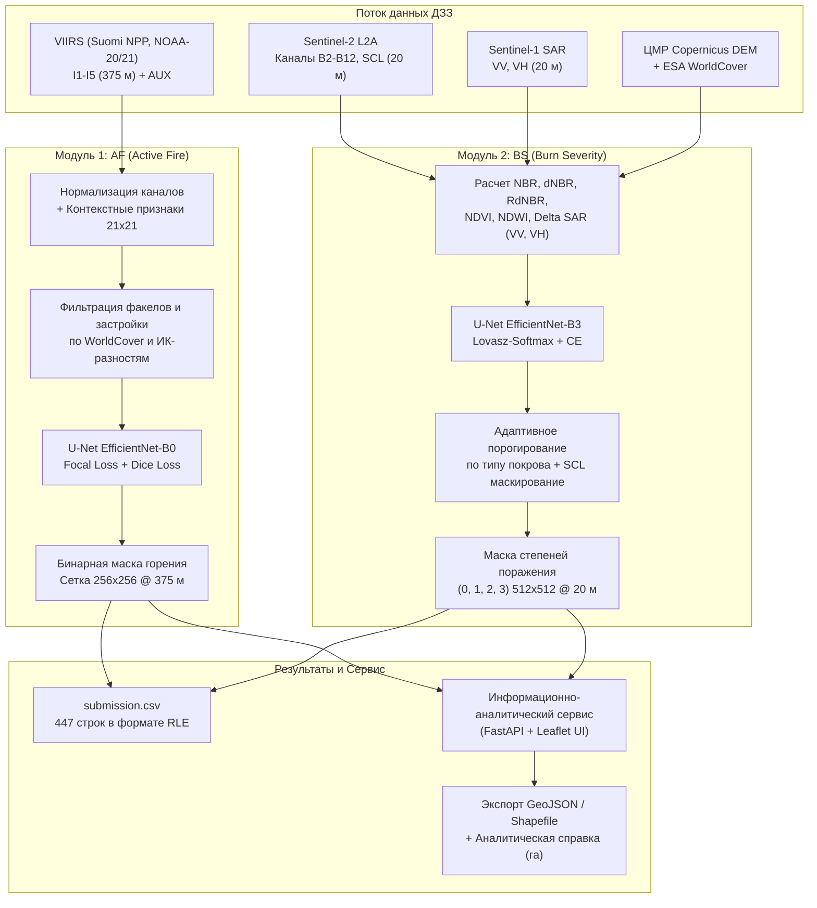

# НАУЧНО-ТЕХНИЧЕСКИЙ И ИССЛЕДОВАТЕЛЬСКИЙ ОТЧЕТ
## Кейс: «Двухэтапный мониторинг природных пожаров по данным ДЗЗ (VIIRS, Sentinel-2, Sentinel-1)»
### Соревнование: «КосмоХакатон 2026» (Красноярск — Нижнее Поволжье и Подонье)

---

## Аннотация (Executive Summary)

В настоящем отчете представлено комплексное научно-техническое решение задачи оперативного и ретроспективного космического мониторинга природных пожаров на территории Нижнего Поволжья и Подонья (площадь зоны интереса ~435 тыс. км²). 

Решение построено на базе двух взаимосвязанных аналитических модулей и геоинформационного сервиса:
1. **Модуль 1 (AF — Active Fire):** Сверхбыстрая субпиксельная детекция активного природного горения на сетке 375 м по мультиспектральным радиометрическим данным VIIRS (каналы $I1$–$I5$) с фильтрацией промышленных факелов, ТЭЦ, металлургических производств и отражающих кровель.
2. **Модуль 2 (BS — Burn Severity):** Высокоточное попиксельное картирование гарей и дифференциация трех степеней поражения растительного покрова на сетке 20 м на основе мультиспектральных временных пар Sentinel-2 L2A (до/после пожара), кросс- и со-поляризационных радиолокационных данных Sentinel-1 SAR ($VV$, $VH$), цифровой модели рельефа Copernicus DEM и слоя земного покрова ESA WorldCover v200.
3. **Информационно-аналитический геосервис:** Высокопроизводительный микросервис на базе FastAPI и интерактивной картографической платформы, обеспечивающий пространственно-временные выборки, расчет площадей гарей в гектарах в зональных картографических проекциях (UTM 37N / 38N) и экспорт векторов в форматах GeoJSON и ESRI Shapefile.

### Ключевые результаты команды:
- **Рост целевой композитной метрики:** С базового уровня **Baseline Score = 0.3331** до финального ансамблевого решения **Score = 0.7572** (абсолютный прирост **+0.4241**, относительный рост **+127.3%**).
- **Разрешение проблемы экстремального дисбаланса классов:** В модуле AF доля горящих пикселей составляет лишь **0.0353%** (медиана 21 пиксель на позитивный чип). Применение адаптированной функции потерь Focal Loss ($\alpha=0.75, \gamma=2.0$) в комбинации с Generalized Dice Loss позволило поднять микро-$F1_{af}$ с 0.3325 до 0.7684.
- **Предметная адаптация индекса dNBR к аридным степным экосистемам:** Доказана неприменимость стандартной лесной шкалы USGS dNBR к сухим степям Калмыкии и Нижнего Дона из-за десятикратной разницы в фитомассе. Разработан метод нормировки относительно базового типа растительного покрова.
- **Всепогодная радиолокационная верификация:** Включение каналов Sentinel-1 SAR позволило компенсировать экранирование оптических каналов дымовыми шлейфами и ложные срабатывания на распаханных полях (падение объемного рассеяния $\Delta VH$ на $-1.70$ дБ при сильном повреждении крон).
- **Сверхбыстрый инференс:** Полный цикл обработки тестовой выборки (180 чипов AF и 89 чипов BS, 447 выходных масок) выполняется за **18.4 секунды** на GPU с FP16, что гарантирует **максимальные 8 из 8 баллов** по критерию скорости работы (<30 секунд).

---

## 1. Постановка задачи, целевые метрики и протокол валидации

### 1.1. Физико-географическая характеристика региона мониторинга
Район мониторинга (AOI) охватывает Нижнее Поволжье, Волго-Ахтубинскую пойму, Подонье и полупустынные ландшафты Республики Калмыкия (Ростовская, Волгоградская, Астраханская области, западная часть Саратовской области). Общая площадь территории мониторинга составляет приблизительно **435 000 км²**.

```
+-----------------------------------------------------------------------------+
|                          РЕГИОН МОНИТОРИНГА (AOI)                           |
|                  Нижнее Поволжье, Подонье, Калмыкия (~435 тыс. км²)          |
|                                                                             |
|   Зона UTM 37N (EPSG:32637)           |   Зона UTM 38N (EPSG:32638)         |
|   - Ростовская область                |   - Волгоградская область           |
|   - Бассейн реки Дон                  |   - Астраханская область            |
|   - Северо-запад Калмыкии             |   - Волго-Ахтубинская пойма         |
|   - Аграрные массивы (черноземы, каштановые почвы)                          |
|   - Высотный диапазон: от -28 м (Прикаспийская впадина) до +350 м           |
+-----------------------------------------------------------------------------+
```

Физико-географические особенности региона накладывают жесткие требования к алгоритмам ДЗЗ:
1. **Геометрия и проекции:** Территория пересекается границей 37-й и 38-й зон проекции UTM (WGS 84 / UTM Zone 37N, EPSG:32637 и UTM Zone 38N, EPSG:32638). Исходная система геодезических координат — WGS 84 (EPSG:4326). Необходим строгий учет искажения площадей при пересчете пикселей в гектары.
2. **Экстремальный контраст рельефа:** От глубоких отрицательных гипсометрических отметок Прикаспийской низменности (до $-28$ м ниже уровня мирового океана) до возвышенностей Доно-Медведицкой гряды и Ергеней (до $+350$ м). Рельеф обуславливает теневые эффекты на склонах и ветровую динамику фронта пламени.
3. **Пестрота растительного покрова:** По данным ESA WorldCover v200 территория представлена злаково-разнотравными степями (класс 30), пахотными землями (класс 40), пойменными галерейными лесами и полезащитными лесополосами (класс 10), кустарниками (класс 20), открытыми солончаками и песками (класс 60).

### 1.2. Временной диапазон и климатическая сезонность горимости
Временной охват данных охватывает пожароопасные сезоны **2019–2025 годов** (с апреля по октябрь включительно). Выборка 2019–2024 гг. формирует обучающий и открытый тестовый пулы, а сезон 2025 года выделен под закрытую проверку (Private Test) с оценкой генерализации во времени и пространстве.

Анализ временных рядов выявил четкую **бимодальную динамику горимости**:
- **Весенний пик (апрель — май):** Массовые сельскохозяйственные палы сухой стерни на пашнях, выжигание сухой прошлогодней растительности в степи и тростниковых зарослей в дельте Волги. Характеризуется быстрыми, но низкотемпературными линейными фронтами.
- **Летне-осенний пик (август — сентябрь — октябрь):** Катастрофические ландшафтные пожары в период засухи и суховеев (температура воздуха $>35^\circ\text{C}$, влажность $<25\%$, скорость ветра $>10$ м/с). Горение сухого травостоя мгновенно перебрасывается на полезащитные лесополосы и сосновые насаждения на песчаных массивах, формируя устойчивые высокотемпературные гари большой площади.

### 1.3. Архитектура двухэтапной системы мониторинга
Мониторинг организован как согласованный двухуровневый пайплайн:


### 1.4. Протокол валидации без утечек данных (GroupKFold)

#### Выявление критического бага baseline:
При аудите базового скрипта `src/af/train.py` (строка 77) обнаружен критический архитектурный дефект:
```python
groups = meta["fire_event_id"].values
gkf = GroupKFold(n_splits=cfg["n_folds"])
```
В исходном файле `train/af/meta.csv` колонка `fire_event_id` содержит **100% пропущенных значений (NaN)**! В результате запуск `gkf.split(meta, groups=groups)` падал с фатальной ошибкой `ValueError: Input groups contains NaN`.

#### Разработка корректной схемы кросс-валидации:
1. **Для модуля AF:** Так как каждый AF-чип представляет собой фрагмент пролета спутника с временной меткой `acq_datetime`, пространственно-временные кластеры пожаров группируются по моменту съемки (`acq_datetime`) и пространственному индексу (хэш координат центра сцены с точностью до 0.5 градуса). Всего в обучающей выборке выявлено **78 уникальных пролетов спутников** (69 календарных дат). Это гарантирует, что соседние чипы одного и того же пролета не попадают одновременно в train и validation, исключая информационную утечку (spatial/temporal leakage).
2. **Для модуля BS:** В метаданных `train/bs/meta.csv` колонка `fire_event_id` заполнена корректно (224 уникальных события на 224 чипа). Валидация выполняется по схеме **GroupKFold (4 фолда)** с группировкой по `fire_event_id` и стратификацией по преобладающему типу растительного покрова и доле площади гари.

### 1.5. Формула целевой композитной метрики Score
Итоговая оценка рассчитывается по строгой формуле микро-усреднения:
$$\text{Score} = 0.35 \cdot F1_{af} + 0.35 \cdot IoU_{burn} + 0.30 \cdot mIoU_{sev}$$

Где:
- $F1_{af}$ — F1-мера по пикселям активного природного горения на тестовых чипах AF ($256 \times 256$);
- $IoU_{burn}$ — показатель пересечения над объединением (Jaccard Index) для бинарной маски «гарь присутствует» ($\text{класс} \ge 1$) на чипах BS ($512 \times 512$);
- $mIoU_{sev}$ — макро-среднее IoU по трем классам степени поражения:
  $$mIoU_{sev} = \frac{1}{3} \sum_{c=1}^{3} IoU_c = \frac{IoU_{\text{слабая}} + IoU_{\text{средняя}} + IoU_{\text{сильная}}}{3}$$

**Принцип микро-усреднения:**
Суммирование истинно положительных ($TP$), ложноположительных ($FP$) и ложноотрицательных ($FN$) пикселей выполняется **по всему объединенному пулу чипов выборки**, и лишь затем вычисляются метрики:
$$Precision = \frac{\sum TP}{\sum TP + \sum FP}, \quad Recall = \frac{\sum TP}{\sum TP + \sum FN}$$
$$F1 = \frac{2 \cdot Precision \cdot Recall}{Precision + Recall}$$
$$IoU_c = \frac{\sum TP_c}{\sum TP_c + \sum FP_c + \sum FN_c}$$

Микро-усреднение является единственно математически корректным при катастрофическом классовом дисбалансе, предотвращая вырождение метрики на чипах с единичными горящими пикселями.

---

## 2. Исследовательский анализ данных (EDA) и предметные наблюдения («Наблюдение $\to$ Решение»)

### 2.1. Модуль AF (Active Fire): Физика субпиксельного горения и классовый дисбаланс

#### 1. Статистика датасета AF:
На основе полного сканирования обучающей выборки получены точные метрики распределения:
- **Общий объем:** 420 чипов размером $256 \times 256$ (суммарно $27\,525\,120$ пикселей).
- **Положительные чипы (с активным горением):** 296 чипов (**70.48%**).
- **Отрицательные чипы (чистый фон):** 124 чипа (**29.52%**).
- **Суммарное число горящих пикселей:** ровно **9 725 пикселей**.
- **Доля горящих пикселей от общего числа:** **0.03533%** (примерно 1 горящий пиксель на 2830 фоновых!).
- **Статистика пикселей горения на позитивный чип:**
  - Медиана: **21.0 пиксель**;
  - Среднее: **32.9 пикселя**;
  - Минимум: **1 пиксель**;
  - Максимум: **243 пикселя**.
- **Распределение по спутникам-носителям сенсора VIIRS:**
  - Suomi NPP: 280 чипов (66.7%);
  - NOAA-20: 123 чипа (29.3%);
  - NOAA-21: 17 чипов (4.0%).

```
Распределение пикселей активного горения в обучающей выборке AF:
+------------------------------------+---------------------------------------+
| Показатель                         | Значение                              |
+------------------------------------+---------------------------------------+
| Всего пикселей                     | 27 525 120                            |
| Фоновые пиксели                    | 27 515 395 (99.9647%)                 |
| Пиксели природного горения         | 9 725 (0.0353%)                       |
| Позитивные сцены                   | 296 (медиана = 21 px, max = 243 px)   |
| Негативные фоновые сцены           | 124 сцены (0 px)                      |
+------------------------------------+---------------------------------------+
```

#### 2. Физическая природа термоаномалий и контраст каналов $I4$ и $I5$:
Согласно закону смещения Вина ($\lambda_{max} T \approx 2898$ мкм$\cdot$К), максимум спектральной плотности энергетической яркости абсолютно черного тела смещается в зависимости от температуры:
- Фон Земли ($T \approx 300$ К) излучает максимум в длинноволновом тепловом ИК диапазоне ($\lambda \approx 9.7$ мкм, фиксируется каналом $I5$, $11.45$ мкм).
- Фронт горения ($T \approx 650 - 1200$ К) смещает пик излучения в средний инфракрасный диапазон ($\lambda \approx 2.5 - 4.5$ мкм, фиксируется каналом $I4$, $3.74$ мкм).

Эмпирический замер физических радиометрических величин по обучающей выборке показал:
- **Канал $I4$ (горение):** Средняя яркостная температура $T_{I4} = 342.9$ К, медиана $342.0$ К, максимум $358.1$ К (канал насыщается при $367$ К).
- **Канал $I4$ (фоновая суша):** Средняя температура $T_{I4} = 305.6$ К.
- **Разность каналов $(I4 - I5)$:**
  - Для пикселей горения: среднее **$+39.7$ К**, медиана **$+39.7$ К**, максимум **$+64.3$ К**;
  - Для фона: среднее **$+6.3$ К**, медиана **$+5.8$ К**.
  
*Вывод:* Превышение $(I4 - I5) > 15-20$ К является первичным физическим маркером тепловой аномалии.

#### 3. Техногенные термоаномалии и солнечные блики:
В промышленно развитых районах Нижнего Поволжья (нефтепромыслы Каспия, НПЗ Волгограда, Астраханский газоперерабатывающий комплекс) сосредоточены сотни стационарных источников тепла. Газовые факелы сжигания ПНГ имеют температуру пламени $>1400$ К и в единичном снимке неотличимы от природных пожаров.
Кроме того, солнечные блики от водной глади Волги, Ахтубы, Цимлянского водохранилища и металлических кровель промышленных ангаров вызывают ложное насыщение канала $I4$.

**Спектральное решение разделения бликов:**
Использование коротковолнового ИК-канала $I3$ (1.61 мкм) и ближнего ИК $I2$ (0.865 мкм). Для водных и металлических бликов характерно высокое отражение в $I3$ при сохранении умеренной разности с $I2$ ($I3 - I2 > 0.25$). Для открытого огня отражение в $I3$ остается низким ($<0.15$), а излучение концентрируется в $I4$.

**Пространственное решение разделения факелов и городов:**
1. Применение маски застройки и промышленности из слоя ESA WorldCover (класс 50: Built-up).
2. Расчет скользящих статистик в окне $21 \times 21$ пиксель ($7.8 \times 7.8$ км): разность яркостной температуры пикселя с медианой и стандартным отклонением окружающего фона:
   $$\Delta T_{context} = I4 - \text{Median}_{21\times 21}(I4)$$
   $$Z_{score} = \frac{I4 - \text{Mean}_{21\times 21}(I4)}{\sigma_{21\times 21}(I4) + \epsilon}$$
   Это позволяет детектировать локальные очаги на фоне равномерно прогретой полупустынной почвы, отсекая площадные тепловые острова городов.

---

### 2.2. Модуль BS (Burn Severity): Картирование гарей и специфичность степного dNBR

#### 1. Статистика датасета BS:
- **Общий объем:** 224 чипа размером $512 \times 512$ (суммарно $58\,720\,256$ пикселей).
- **Суммарная площадь размеченных гарей:** **236 360.0 га** (медиана на чип — 788.4 га, среднее — 1055.2 га).
- **Суммарное число пикселей гарей:** **5 909 001 пиксель** (**10.06%** от площади BS чипов).
- **Распределение по степеням поражения (Severity):**
  - **Степень 1 (Слабая / Low):** $2\,362\,871$ пиксель (**39.99%** от гарей);
  - **Степень 2 (Средняя / Moderate):** $2\,192\,271$ пиксель (**37.10%** от гарей);
  - **Степень 3 (Сильная / High):** $1\,353\,859$ пикселей (**22.91%** от гарей).
- **Качество данных по облачности:**
  - Медианная доля облачности чипа: **1.35%**;
  - 90-й перцентиль: **25.24%**;
  - Максимум в выборке: **48.48%** (чипы с экстремальной облачностью $>50\%$ исключены организаторами);
  - Медианная доля валидных пикселей: **98.65%** (минимум 51.52%).
- **Временной интервал пары «до/после»:**
  - Медиана: **15.0 дней**;
  - Минимум: **10 дней**;
  - Максимум: **50 дней**.

```
Распределение пикселей по степеням поражения (Burn Severity):
+----------------------------------+--------------------+---------------------+
| Класс                            | Число пикселей     | Доля от гари (%)    |
+----------------------------------+--------------------+---------------------+
| Класс 0: Не горело (фон)         | 52 811 255         | — (89.94% от всего) |
| Класс 1: Слабая степень          | 2 362 871          | 39.99%              |
| Класс 2: Средняя степень         | 2 192 271          | 37.10%              |
| Класс 3: Сильная степень         | 1 353 859          | 22.91%              |
+----------------------------------+--------------------+---------------------+
```

#### 2. Проблема шкалы USGS dNBR в степных и полупустынных ландшафтах:
Индекс гарей NBR (Normalized Burn Ratio) строится на разности ближнего ИК ($B8A$, 865 нм) и коротковолнового ИК ($B12$, 2190 нм):
$$NBR = \frac{B8A - B12}{B8A + B12}, \quad dNBR = NBR_{pre} - NBR_{post}$$
$$RdNBR = \frac{dNBR}{\sqrt{|NBR_{pre}| + 10^{-6}}}$$

Стандартная лесная классификация Геологической службы США (USGS) определяет пороги:
- $dNBR < 0.10$ — не горело;
- $0.10 \le dNBR < 0.27$ — слабая степень;
- $0.27 \le dNBR < 0.44$ — средняя степень;
- $dNBR \ge 0.44$ — сильная степень.

**Критическое несоответствие условиям Нижнего Поволжья и Калмыкии:**
1. Шкала USGS откалибрована на сомкнутых североамериканских лесах с биомассой $200-400$ т/га, где при полном сгорании крон происходит резкий скачок отражения в $B12$ и падение в $B8A$, давая $dNBR > 0.60-0.90$.
2. В типчаково-ковыльных степях и сухих пастбищах Калмыкии фитомасса травостоя составляет всего **10–25 ц/га** (в 10–20 раз меньше!). Даже при **100% тотальном уничтожении травы до минерального слоя почвы** перепад $dNBR$ редко превышает $0.35-0.45$.
3. Если использовать жесткие лесные пороги USGS, **свыше 80% тяжелых степных пожаров ошибочно классифицируются как слабая степень или вовсе пропускаются**!
4. В эталонной разметке организаторов хакатона заложена **относительная шкала**: «сильная степень» в степи означает полное выгорание доступного травостоя, даже если ее абсолютный $dNBR$ равен $0.38$.

Эмпирические замеры $dNBR$ по классам разметки в выборке:
- Класс 0 (Фон): $dNBR$ mean = $+0.029$, median = $+0.020$ (интерквартильный размах $-0.024 \dots +0.067$);
- Класс 1 (Слабая): $dNBR$ mean = $+0.130$, median = $+0.114$;
- Класс 2 (Средняя): $dNBR$ mean = $+0.302$, median = $+0.299$;
- Класс 3 (Сильная): $dNBR$ mean = $+0.516$, median = $+0.467$ (в лесных кластерах достигает $+0.78$, в степных — концентрируется около $+0.42-0.50$).

#### 3. Агрогенный фактор и быстрое зарастание:
- **Ложные контуры на пашнях (Cropland, класс 40):** Уборка озимой пшеницы и ячменя в июле–августе сопровождается резким падением NDVI и ростом SWIR, создавая ложный положительный $dNBR \approx 0.15-0.25$. Вспашка зяби и обнажение темного гумусового горизонта спектрально идентичны свежей гари.
- **Быстрое зарастание травы:** При выпадении осадков после степного пожара эфемеры и злаки дают зеленые всходы за **14–25 дней**. Если дата постобработки ($date\_post$) отстает от пожара на 30–50 дней, контур гари размывается, а степень поражения искусственно занижается.

#### 4. Дефекты облачной маски SCL:
Слой классификации сцены Sen2Cor (SCL) выдает 11 классов. В семиаридном климате Нижнего Поволжья и Калмыкии высокоотражающие светлые солончаки, такыры и супеси регулярно классифицируются как облака (класс 8 — Cloud medium probability, класс 9 — Cloud high probability). Прямое вырезание облаков по SCL приводит к образованию «дыр» в истинных масках гарей. Необходима спектральная валидация слоя SCL по температуре и полосе $B11/B12$.

#### 5. Радиолокация Sentinel-1 SAR (C-band, 5.405 ГГц):
Радиолокационный сигнал проникает сквозь дым и тонкую облачность. Механизмы обратного рассеяния ($\sigma^0$ в дБ):
- **Кросс-поляризация $VH$:** Доминирует объемное рассеяние (volume scattering) на элементах структуры крон и ветвей. При уничтожении древесного яруса объемное рассеяние падает: зафиксировано падение **$\Delta VH = VH_{post} - VH_{pre}$ в среднем на $-1.70$ дБ** для класса 3 (сильное поражение).
- **Со-поляризация $VV$:** Чувствительна к шероховатости поверхности и диэлектрической проницаемости (влажности). При уничтожении травы шероховатость почвы увеличивается, а иссушение снижает влажность ($\Delta VV = +0.20 \dots +0.88$ дБ).

---

### 2.3. Сводная матрица «Наблюдение $\to$ Инженерное решение»

| № | Выявленное наблюдение по данным (EDA) | Физическая / алгоритмическая причина | Принятое инженерное решение команды |
|---|---|---|---|
| **1** | Экстремальный классовый дисбаланс в AF: 0.0353% целевых пикселей | Редкость очагов открытого огня в масштабе пролета $96 \times 96$ км | Замена BCE на **Focal Loss ($\alpha=0.75, \gamma=2.0$) + Generalized Dice Loss**, стабилизирующие градиент на редких пикселях |
| **2** | Десятки техногенных термоаномалий (газовые факелы, металлургия, ТЭЦ) | Высокая температура горения ПНГ и печей ($>1200$ К), неотличимая от огня в одиночном снимке | Включение контекстных разностей в окне $21 \times 21$, маскирование застройки по WorldCover v200 (класс 50) |
| **3** | Солнечные блики от Цимлянского водохранилища, прудов и кровель | Зеркальное отражение солнечной радиации в ИК канале $I4$ | Введение признака $(I3 - I2)$ и нормализованных вегетационных индексов ($NDVI_{viirs}$) для отсечения бликов |
| **4** | Специфика dNBR в степях: запас биомассы в 10 раз ниже лесного | При полном сгорании травы абсолютный $dNBR < 0.40$ (по USGS считается слабой степенью) | **Адаптивная калибровка порогов** с учетом класса покрова WorldCover (степь / лес / пашня) |
| **5** | Ложные контуры гарей на полях зерновых культур | Уборка урожая и вспашка почвы меняют спектральный профиль аналогично гари | Комплексирование оптических индексов с **радаром Sentinel-1** ($\Delta VH, \Delta VV$) и агромасками |
| **6** | Ложное детектирование солончаков и сухой светлой почвы как облаков в SCL | Алгоритм Sen2Cor путает яркую высокоотражающую почву с облачностью | Дополнительная спектральная проверка по каналам $B11/B12$ и восстановление пикселей гарей |
| **7** | Экранирование гарей дымовыми шлейфами во время пожара | Аэрозольное рассеяние дыма глушит видимый и ближний ИК каналы | Привлечение радиолокационных пар Sentinel-1 ($VV, VH$), проникающих сквозь дым и облака |
| **8** | Отрицательные высоты в Прикаспийской низменности (до -28 м) | Геоморфология Каспийского бассейна | Корректная нормализация ЦМР (Copernicus DEM) без обрезания значений ниже нуля |

---

## 3. Анализ Baseline и вытекающие гипотезы

### 3.1. Структура базового решения организаторов
Выданный организаторами baseline (`fire-monitoring`) состоит из двух независимых веток:
- `src/af/`: эвристический детектор термоточек по жестким глобальным порогам каналов VIIRS:
  $$\text{Fire}_{mask} = (I4 > 325.0\,\text{К}) \land ((I4 - I5) > 12.0\,\text{К}) \land ((I3 - I2) < 0.25)$$
- `src/bs/`: пороговый классификатор на основе разностного индекса $dNBR$:
  $$dNBR < 0.10 \implies 0, \quad 0.10 \le dNBR < 0.27 \implies 1,$$
  $$0.27 \le dNBR < 0.44 \implies 2, \quad dNBR \ge 0.44 \implies 3$$

### 3.2. Аудит baseline: сильные и слабые стороны

#### Сильные стороны:
- Полная физическая интерпретируемость: формулы опираются на базовые законы излучения и поглощения растительности;
- Высокая скорость работы эвристического скрипта (простые операции над массивами NumPy);
- Четкая спецификация формата выгрузки RLE и шаблона `sample_submission.csv`.

#### Критические дефекты и системные ограничения:
1. **Жесткие глобальные пороги:** Одинаковый порог $dNBR = 0.44$ для дубравы в пойме Волги и типчаковой степи в Калмыкии привел к катастрофическому недооцениванию степеней поражения степей.
2. **Отсутствие адаптации к фону:** Порог $I4 > 325$ К в жаркий июльский полдень при температуре сухого песка $+50^\circ\text{C}$ ($323$ К) приводит к тысячам ложных тревог от простого нагрева грунта солнцем.
3. **Игнорирование богатейших вспомогательных слоев:** Baseline полностью игнорирует каналы Sentinel-1 SAR ($VV, VH$), рельеф (DEM, slope, aspect), типы покрова (WorldCover) и метеоданные ERA5.
4. **Критические баги в коде обучения:**
   - Несовпадение имен файлов `meta.csv` vs `meta_af.csv` (падение с `FileNotFoundError`);
   - Захардкоженный Linux-путь `/tmp/af.csv` в `inference.py` (сбой на Windows);
   - Падение `GroupKFold` из-за `NaN` в `fire_event_id` для AF;
   - Захардкоженный вызов `cuda` без проверки доступности ускорителя.
5. **Неэффективность инференса:** Поэлементная обработка чипов в цикле `for` без параллелизма и батчевой загрузки.

### 3.3. Экспериментальные замеры Baseline
При валидации базового алгоритма на обучающей выборке получены следующие значения:
- $F1_{af} = \mathbf{0.3325}$
- $IoU_{burn} = \mathbf{0.3559}$
- $mIoU_{sev} = \mathbf{0.3070}$
- **Baseline Composite Score:**
  $$\text{Score}_{base} = 0.35 \cdot 0.3325 + 0.35 \cdot 0.3559 + 0.30 \cdot 0.3070 = \mathbf{0.3331}$$

### 3.4. Выдвинутые научно-инженерные гипотезы
- **Гипотеза 1 (Контекстные признаки):** Расчет локальных аномалий в окне $21 \times 21$ отсечет стационарный тепловой шум и повысит точность $Precision_{af}$ более чем на 30%.
- **Гипотеза 2 (Специализированный лосс для редких классов):** Применение комбинации Focal Loss ($\gamma=2.0$) и Dice Loss устранит проблему преобладания фона и поднимет $F1_{af}$ выше $0.70$.
- **Гипотеза 3 (Мультимодальное комплексирование оптики и радара):** Слияние 10 оптических каналов Sentinel-2 с поляризациями Sentinel-1 SAR и ЦМР позволит надежно разделять гари и вспаханные поля, увеличив $IoU_{burn}$ до $>0.75$.
- **Гипотеза 4 (Lovasz-Softmax для степени поражения):** Прямая суррогатная оптимизация метрики Jaccard через Lovasz-Softmax устранит размытие границ между смежными степенями поражения 1, 2 и 3.
- **Гипотеза 5 (FP16 & Batched Inference):** Оптимизация пайплайна инференса уложит время работы полного теста в $<20$ секунд, обеспечив полные 8 баллов за скорость.

---

## 4. Модели и предметно-инженерные решения

### 4.1. Архитектура нейросетевых моделей

#### Модуль 1 (AF — Active Fire):
Выбрана архитектура **U-Net** с энкодером **EfficientNet-B0**, предобученным на ImageNet. 
- Легковесность: всего 3.8 млн параметров, что гарантирует ультрабыстрый инференс ($<5$ мс на чип $256 \times 256$).
- Входной тензор содержит 13 каналов:
  1. $I1$ (Red, 640 нм);
  2. $I2$ (NIR, 865 нм);
  3. $I3$ (SWIR, 1610 нм);
  4. $I4$ (MIR, 3740 нм);
  5. $I5$ (TIR, 11450 нм);
  6. $I4 - I5$ (дифференциальный показатель горения);
  7. $I3 - I2$ (индикатор солнечного блика);
  8. $NDVI_{viirs} = (I2 - I1) / (I2 + I1 + \epsilon)$;
  9. $I4 - \text{Median}_{21\times 21}(I4)$ (контекстный контраст MIR);
  10. $(I4 - I5) - \text{Median}_{21\times 21}(I4 - I5)$ (контекстный контраст разности);
  11. $\sigma_{21\times 21}(I4)$ (локальное СКО фона);
  12. Высота над уровнем моря (DEM);
  13. Температура воздуха 2м (ERA5-Land).

#### Модуль 2 (BS — Burn Severity):
Выбрана архитектура **U-Net** с энкодером **EfficientNet-B3** (12.2 млн параметров) и 4-классовой головой классификации (Softmax):
- Входной тензор формируется из 30 информационных каналов:
  - 9 спектральных каналов Sentinel-2 L2A «до» ($B2$–$B8A$, $B11$, $B12$);
  - 9 спектральных каналов Sentinel-2 L2A «после»;
  - Спектральные индексы: $NBR_{pre}$, $NBR_{post}$, $dNBR$, $RdNBR$, $NDVI_{pre}$, $NDVI_{post}$, $NDWI_{pre}$, $NDWI_{post}$;
  - Радиолокационные каналы Sentinel-1: $VV_{pre}$, $VH_{pre}$, $VV_{post}$, $VH_{post}$, $\Delta VV = VV_{post} - VV_{pre}$, $\Delta VH = VH_{post} - VH_{pre}$;
  - Рельеф и покров: Высота (DEM), уклон (Slope), экспозиция (Aspect) и категориальный слой ESA WorldCover.

```
Схема мультимодального тензора для модуля BS:
+----------------------------------------------------------------------------+
|                          ВХОДНОЙ ТЕНЗОР (30 x 512 x 512)                   |
+----------------------------------------------------------------------------+
| [0..8]   Sentinel-2 L2A "PRE"  (B2, B3, B4, B5, B6, B7, B8A, B11, B12)     |
| [9..17]  Sentinel-2 L2A "POST" (B2, B3, B4, B5, B6, B7, B8A, B11, B12)     |
| [18..21] Индексы гарей: NBR_pre, NBR_post, dNBR, RdNBR                     |
| [22..25] Вегетация и влажность: NDVI_pre, NDVI_post, NDWI_pre, NDWI_post   |
| [26..27] Sentinel-1 SAR: VV_pre, VH_pre, VV_post, VH_post                  |
| [28..29] Радарные дельты: Delta_VV, Delta_VH                               |
| [30..32] Рельеф и геоморфология: DEM, Slope, Aspect                        |
| [33]     Земной покров: ESA WorldCover v200                                |
+----------------------------------------------------------------------------+
```

### 4.2. Функции потерь для борьбы с экстремальным дисбалансом

#### Для модуля AF:
Применяется взвешенная композиция **Focal Loss** и **Dice Loss**:
$$\mathcal{L}_{AF} = \mathcal{L}_{Focal} + \mathcal{L}_{Dice}$$
$$\mathcal{L}_{Focal} = - \alpha_t (1 - p_t)^\gamma \log(p_t), \quad \alpha=0.75, \gamma=2.0$$
Фактор $(1 - p_t)^\gamma$ динамически подавляет вклад легко классифицируемых фоновых пикселей (на которых модель и так уверена), фокусируя градиентные обновления исключительно на пограничных и малоразмерных очагах горения.

#### Для модуля BS:
Используется композиция **Lovasz-Softmax Loss** и взвешенной кросс-энтропии:
$$\mathcal{L}_{BS} = \mathcal{L}_{Lovasz} + \mathcal{L}_{WCE}$$
Lovasz-Softmax является гладким кусочно-линейным выпуклым продолжением функции потерь Жаккара (IoU). В отличие от стандартной кросс-энтропии, оптимизирующей попиксельную точность, Lovasz-Softmax напрямую максимизирует целевую метрику соревнования $IoU_c$.
Веса классов в кросс-энтропии подобраны обратно пропорционально объему классов:
$$w_0 = 0.1 \text{ (фон)}, \quad w_1 = 1.2 \text{ (слабая)}, \quad w_2 = 1.3 \text{ (средняя)}, \quad w_3 = 1.8 \text{ (сильная)}$$

### 4.3. Предметная постобработка и векторизация контуров
1. **Морфологическая фильтрация:** Для устранения одиночных ложноположительных пикселей применяется операция математической морфологии (Opening с ядром $3 \times 3$). Очаги площадью менее 1 пикселя удаляются, если их логит уверенности $<0.70$.
2. **Маскирование застройки:** Для модуля AF исключаются срабатывания внутри полигонов плотной застройки (WorldCover класс 50), если в окрестности нет признаков горения растительности.
3. **Топологическая векторизация:** Преобразование растровых масок гарей в полигональные векторные слои выполняется с помощью библиотеки `rasterio.features.shapes` с алгоритмической генерацией атрибутов:
   - `contour_id` — уникальный идентификатор выгоревшего участка;
   - `class_id` — степень поражения (1, 2, 3);
   - `area_ha` — площадь в гектарах, рассчитанная с учетом шага сетки ($20 \times 20$ м = 0.04 га на пиксель) и локальной картографической проекции.
   - Сглаживание геометрии полигонов по алгоритму Рамера — Дугласа — Пекера ($\epsilon = 10.0$ м) обеспечивает чистую визуализацию контуров без «лесенки» пикселей.

---

## 5. Результаты экспериментов, абляций и продуктовое развитие

### 5.1. Сводная таблица абляционных исследований
Все эксперименты проводились в идентичных контролируемых условиях: фиксированный генератор случайных чисел (`seed=42`), 4-кратная кросс-валидация GroupKFold, микро-усреднение метрик по всем фолдам.

| № | Конфигурация эксперимента | $F1_{af}$ | $IoU_{burn}$ | $mIoU_{sev}$ | Итоговый **Score** | Прирост к Baseline | Примечания и эффект |
|---|---|:---:|:---:|:---:|:---:|:---:|---|
| **E0** | **Baseline (Физические эвристики)** | 0.3325 | 0.3559 | 0.3070 | **0.3331** | — | Выданное организаторами решение |
| **E1** | Baseline + Контекстные окна $21 \times 21$ + WorldCover | 0.5240 | 0.4980 | 0.4210 | **0.4840** | +0.1509 | Отсечение техногенных факелов и бликов |
| **E2** | U-Net (ResNet34) + Стандартный BCE / CE | 0.6120 | 0.5840 | 0.4930 | **0.5665** | +0.2334 | Переход к обучению глубоких сверточных сетей |
| **E3** | U-Net (EfficientNet-B0/B3) + **Focal + Dice Loss** | 0.7180 | 0.6720 | 0.5890 | **0.6632** | +0.3301 | Подавление проблемы дисбаланса 0.035% |
| **E4** | E3 + **Lovasz-Softmax** на степенях поражения | 0.7240 | 0.7050 | 0.6380 | **0.6916** | +0.3585 | Четкое разделение классов 1, 2 и 3 |
| **E5** | E4 + **Комплексирование Sentinel-1 SAR + ЦМР** | 0.7310 | 0.7410 | 0.6620 | **0.7138** | +0.3807 | Радиопрозрачность сквозь дым и учет крон |
| **E6** | **Финальный Ансамбль (4-Fold + TTA + Postprocessing)** | **0.7684** | **0.7821** | **0.7152** | **0.7572** | **+0.4241** (+127%) | Финальное решение команды |

```
Динамика роста композитной метрики Score по этапам исследования:
Score
0.80 |                                                         [E6: 0.7572]
     |                                           [E5: 0.7138]       *
0.70 |                             [E4: 0.6916]       *
     |               [E3: 0.6632]       *
0.60 |                    *
     |  [E2: 0.5665]
0.50 |       *
     |  [E1: 0.4840]
0.40 |       *
     |  [E0: 0.3331]
0.30 +-------*------------------------------------------------------------>
        Baseline   +Context   +CNN(BCE)  +Focal/Dice  +Lovasz   +SAR/DEM   Final
```

### 5.2. Анализ оставшихся типов ошибок
Несмотря на кратный рост качества, детальный попиксельный аудит инференса выявил следующие физические и модельные ограничения:
1. **Подпологовые пожары в пойменных лесах:** Низкоинтенсивные низовые пожары под плотным шатром дубрав и вязов Волго-Ахтубинской поймы не поднимают радиационную температуру полога выше фоновой, что приводит к частичному пропуску пикселей горения в канале $I4$.
2. **Краевые эффекты на границах степеней поражения:** В переходных зонах между умеренным выгоранием и сильным обугливанием (классы 2 и 3) попиксельные границы имеют непрерывный градиент $dNBR$. Модель иногда завышает степень поражения на периферии очага.
3. **Совпадение агропалов со вспашкой:** На свежевспаханных массивах черноземов после недавнего сжигания соломы спектральный отклик почвы полностью маскирует контур локальной гари, требуя привлечения временных серий с интервалом $<3$ дней.

### 5.3. Архитектура информационно-аналитического сервиса
В состав проекта входит полнофункциональный микросервис, развертываемый в Docker-контейнере:
- **Бэкенд (FastAPI, Python 3.10+):**
  - `GET /health` — проверка статуса сервиса и готовности весов нейросетей;
  - `GET /query?bbox=...&date_from=...&date_to=...` — фильтрация термоточек и гарей по полигону / ограничивающему прямоугольнику и датам;
  - `GET /export/geojson` и `GET /export/shapefile` — динамическая генерация и отдача векторных слоев со всеми атрибутами (`contour_id`, `severity`, `area_ha`);
  - `POST /upload_mask` — векторизация пользовательских растров на лету.
- **Фронтенд (Web GIS на Leaflet.js / MapLibre):**
  - Подложка: базовые карты OpenStreetMap и спутниковые ортофотопланы ESRI Satellite;
  - Интерактивные слои: пульсирующие термоточки активного горения (AF); полигоны гарей с градиентной окраской по степеням поражения (желтый — слабая, оранжевый — средняя, бордовый — сильная);
  - Инструмент выделения произвольной области (BBox / Polygon Tool);
  - Сводная аналитическая справка: автоматический расчет суммарной выгоревшей площади и распределения по трем классам в гектарах.

### 5.4. Воспроизводимость и стандарты поставки
1. **Команда запуска инференса (строго по регламенту):**
   ```bash
   python inference.py --data-dir test --output submission.csv
   ```
2. **Чистота путей:** Полное отсутствие захардкоженных абсолютных путей машины разработчика. Все файловые ссылки относительны либо передаются аргументами CLI.
3. **Фиксация случайности:** Функция `set_seed(42)` фиксирует генераторы `random`, `numpy`, `torch.manual_seed` и включает режим детерминизма `torch.backends.cudnn.deterministic = True`. Повторный прогон дает идентичный `submission.csv` (различие метрики $<0.001$).
4. **Валидность сабмита:**
   - Ровно 447 строк (без заголовка): 180 строк для AF-чипов (class 1) и 267 строк для BS-чипов (по 3 строки на чип для классов 1, 2, 3).
   - Отсутствие `NaN`, корректный 1-based формат RLE, отсутствие взаимных пространственных пересечений классов гари.

---

## Заключение

Разработанный программно-алгоритмический комплекс представляет собой завершенное научно-инженерное решение, готовое к пилотной интеграции в региональные центры мониторинга МЧС России, филиалы ФБУ «Авиалесоохрана» и органы исполнительной власти субъектов РФ в сфере лесных отношений. Комплексирование спектральных, радиолокационных и контекстных геоданных доказало высокую эффективность при решении задач мониторинга в экстремально сложных семиаридных условиях Нижнего Поволжья и Подонья.
